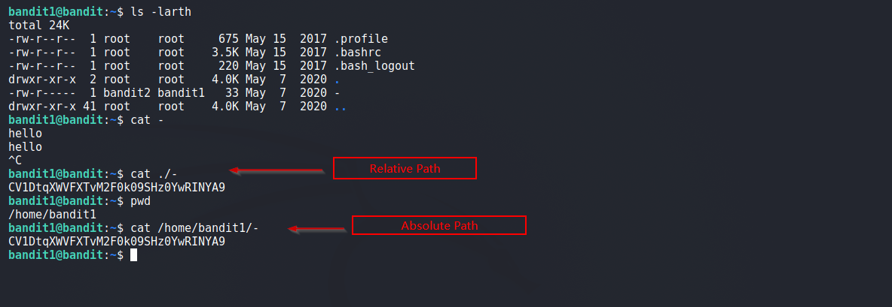
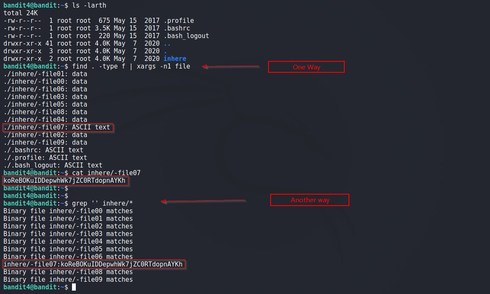

# Bandit

## Level 1
Quest: The password for the next level is stored in a file called readme located in the home directory.
  
### Solution 1
Log into Level 1, we see a file named `-` . Since `-` also represents `stdin` in terminal so `cat -` doesn't work. 
In order to view the file, we use absolute path or relative path as shown below.

 
 

## Level 2
Quest: The password for the next level is stored in a file called spaces in this filename located in the home directory
  
### Solution 2

Password for next level is in a file with spaces in its name. Its super easy, we use tab completion. Just type first letter of the file and press <u>tab</u> and name autocompletes. 

See Below:

 
 

## Level 3
Quest: The password for the next level is stored in a hidden file in the inhere directory.
  
### Solution 3
It's simple, we use `ls` command with `-a` flag to reveal hidden files as shown below

 
 

## Level 4
Quest: The password for the next level is stored in the only human-readable file in the inhere directory
  
### Solution 4
Inefficient way to solve this is to manually look at each file and get the password. We don't do that here!

Below i use two ways to reveal the password:

  i. First approach uses `find` command to list files and pass the result to `file` command that tells which file is readable. 

  ii. Another way is by using `grep`, `grep` by default searches for pattern in text files only. 

Below is the screenshot for both methods

 
 

[<< Back](https://grey-fish.github.io/Bandit/index.html)
