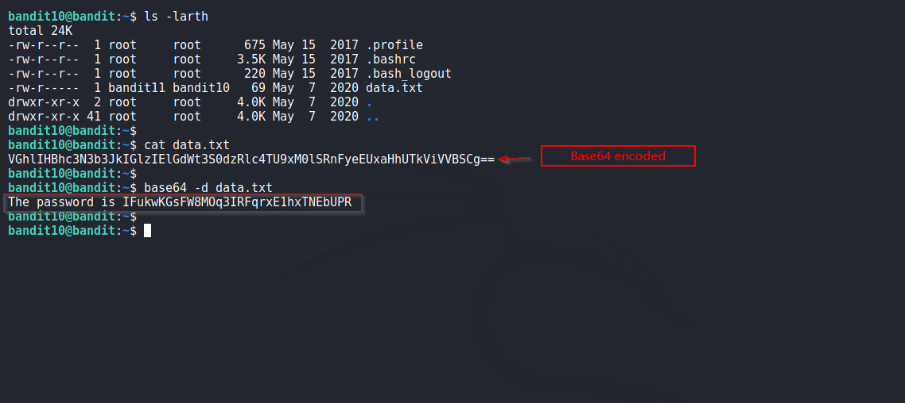

# Bandit

## Level 10
The password for the next level is stored in the file data.txt, which contains base64 encoded data

<br/>
## Solution

Our task is pretty simple: decode base64 to reveal password.

<br/>
Final Command:
```shell
$ base64 -d data.txt             # -d for decoding
```

<br/>
Solution Screenshot



<br/>
<span id=green>**Takeaway**</span><br/>

  - RTFM<br/>

<br/>

[<< Back](https://grey-fish.github.io/Bandit/index.html)
