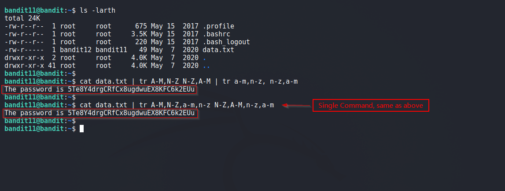

# Level 11
The password for the next level is stored in the file data.txt, where all lowercase (a-z) and uppercase (A-Z) letters have been rotated by 13 positions

<br/>
## Solution

We are dealing with rot 13 algo. Lets use `tr` command to solve the problem. 

From the `tr` docs
> Translate, squeeze, and/or delete characters from standard input, writing to standard output.<br/>
> CHAR1-CHAR2<br/>
>   all characters from CHAR1 to CHAR2 in ascending order

Lets do some tests.

```shell
                           
$ echo "abcdefghjklmnopqrstuvwxyz" | tr [a-f] [A-F]
ABCDEFghjklmnopqrstuvwxyz
  
$ echo "abcdefghjklmnopqrstuvwxyz" | tr a-f A-F 
ABCDEFghjklmnopqrstuvwxyz
    
$ echo "abcdefghjklmnopqrstuvwxyz" | tr l-w L-W
abcdefghjkLMNOPQRSTUVWxyz

$ echo "abcdefghijklmnopqrstuvwxyz" | tr b-e,u-y B-E,U-Y
aBCDEfghijklmnopqrstUVWXYz

```

Above we see usage of translate command, now lets build our solution

  ABCDEFGHIJKLM<br/>
  |||||||||||||<br/>
  NOPQRSTUVWXYZ<br/>
  
So A-M translate to N-Z and N-Z translate to A-M. So `A-M,N-Z` -> `N-Z,A-M` 

Final Command:
```shell
# Seprate handling of lower and upper case letters
$ cat data.txt | tr A-M,N-Z N-Z,A-M | tr a-m,n-z, n-z,a-m

# Single command
$ cat data.txt | tr A-M,N-Z,a-m,n-z N-Z,A-M,n-z,a-m
```

Solution Screenshot:



<br/>

<span id=green>**Takeaway**</span><br/>

  - It's getting Repetitive but RTFM.<br/>

<br/>

[<< Back](https://grey-fish.github.io/Bandit/index.html)
