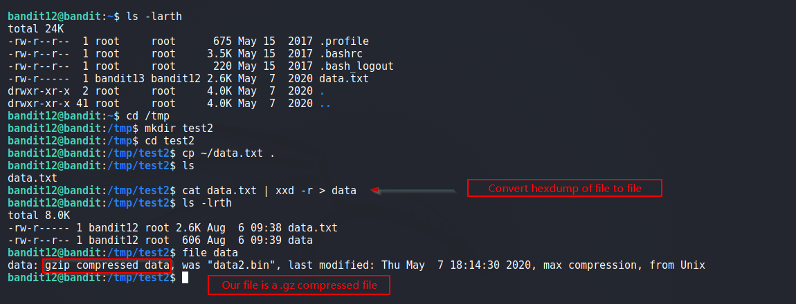

# Bandit

## Level 12
The password for the next level is stored in the file data.txt, which is a hexdump of a file that has been repeatedly compressed. For this level it may be useful to create a directory under /tmp in which you can work using mkdir. For example: mkdir /tmp/myname123. Then copy the datafile using cp, and rename it using mv (read the manpages!)

<br/>
## Solution
In order to get the original file back from hexdump, we use `xxd` command

```shell
$ cat data.txt | xxd -r > data
```

<br/>
Screenshot:



The resulting file: `data` is a gzip compressed file. Below we decompress it multiple times using different utilities accordingly.

Now we uncompress the file several times using the tools depending upon filetype until password is revealed.

<br/>
Screenshot 1


<br/>
Screenshot 2


<br/>
<span id=green>**Takeaway**</span><br/>

  - We can original file from its hexdump.<br/>

<br/>

[<< Back](https://grey-fish.github.io/Bandit/index.html)
