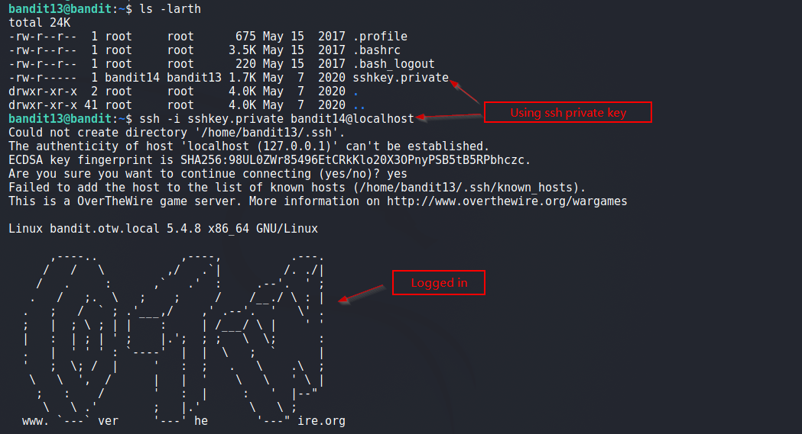
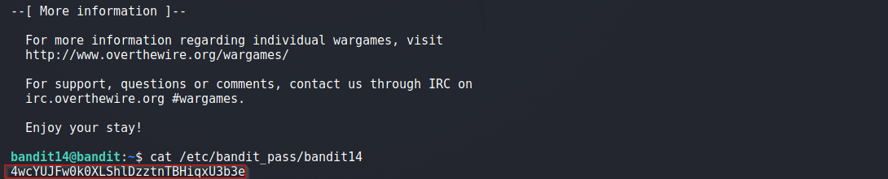

# Bandit

## Level 13
The password for the next level is stored in /etc/bandit_pass/bandit14 and can only be read by user bandit14. For this level, you don’t get the next password, but you get a private SSH key that can be used to log into the next level. Note: localhost is a hostname that refers to the machine you are working on

<br/>
## Solution
We are given a private SSH key, which we use to login and read password for next Level.

<br/>
Final Command:
```shell
$ ssh -i sshkey.private bandit14@localhost
```

<br/>
Solution Screenshots:




<br/>

[<< Back](https://grey-fish.github.io/Bandit/index.html)
