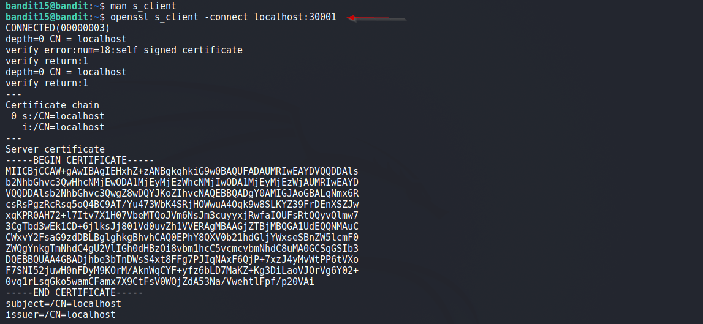
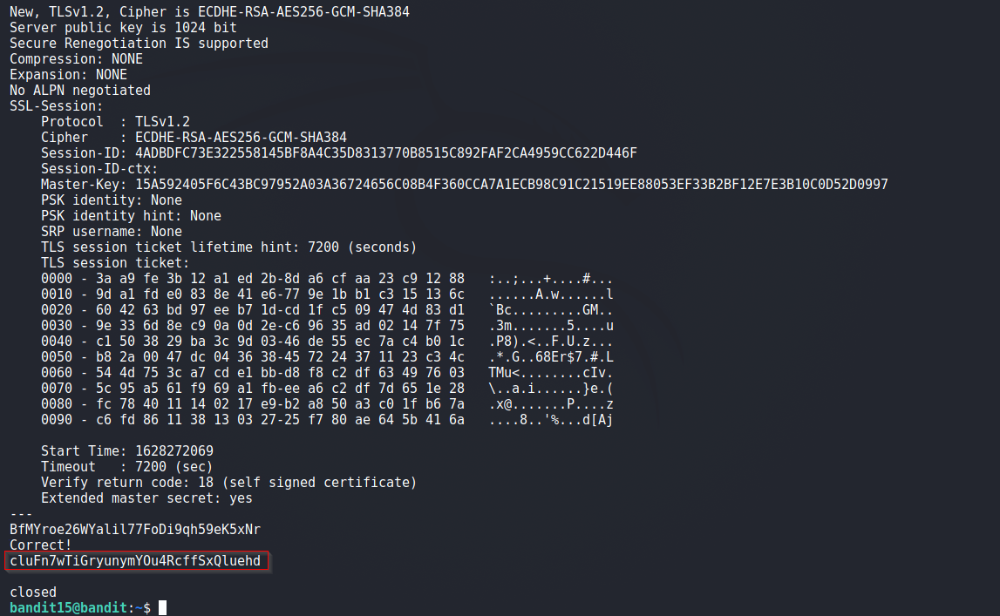

# Bandit

## Level 15
The password for the next level can be retrieved by submitting the password of the current level to port 30001 on localhost using SSL encryption.<br/>

Helpful note: Getting “HEARTBEATING” and “Read R BLOCK”? Use -ign_eof and read the “CONNECTED COMMANDS” section in the manpage. Next to ‘R’ and ‘Q’, the ‘B’ command also works in this version of that command…

<br/>
## Solution

As said in the problem, first step is to read the manual.

From the docs:
> The s_client command implements a generic SSL/TLS client which connects to a remote host using SSL/TLS. It is a very usefuldiagnostic tool for SSL servers.<br/>
> s_client can be used to debug SSL servers. To connect to an SSL HTTP server the command:<br/>
>      openssl s_client -connect servername:443<br/>
>  If the connection succeeds then an HTTP command can be given such as "GET /" to retrieve a web page.<br/>

So, our final Command:
```shell
$ openssl s_client -connect localhost:30001
```

<br/>
Solution Screenshots:




<br/>

[<< Back](https://grey-fish.github.io/Bandit/index.html)


