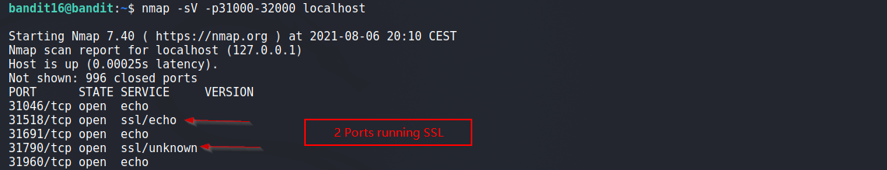
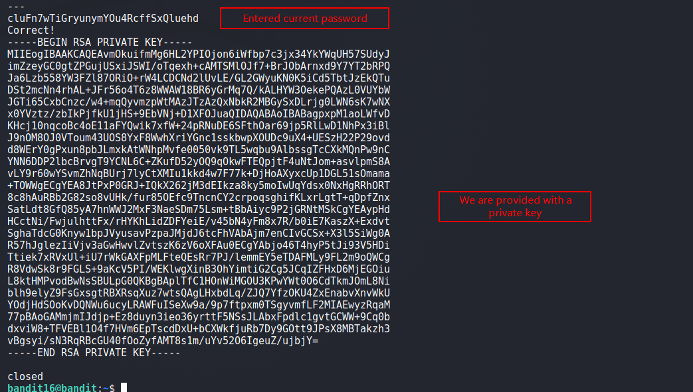
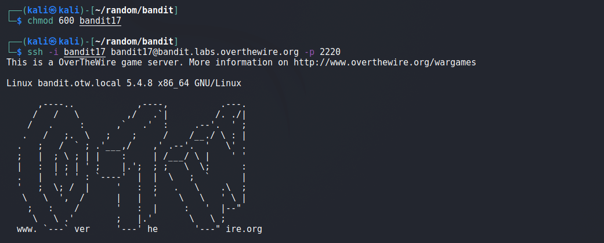

# Bandit

## Level 16
The credentials for the next level can be retrieved by submitting the password of the current level to a port on localhost in the range 31000 to 32000. First find out which of these ports have a server listening on them. Then find out which of those speak SSL and which don’t. There is only 1 server that will give the next credentials, the others will simply send back to you whatever you send to it.

 
## Solution
Running `nmap` on localhost found two ports running SSL as shown below:

No luck on port 31518, but on port 31790, get a private SSH key (hopefully for bandit17).

 
Copy the key, set appropriate permissions and try to login as bandit17. 

This works!
 

[<< Back](https://grey-fish.github.io/Bandit/index.html)
