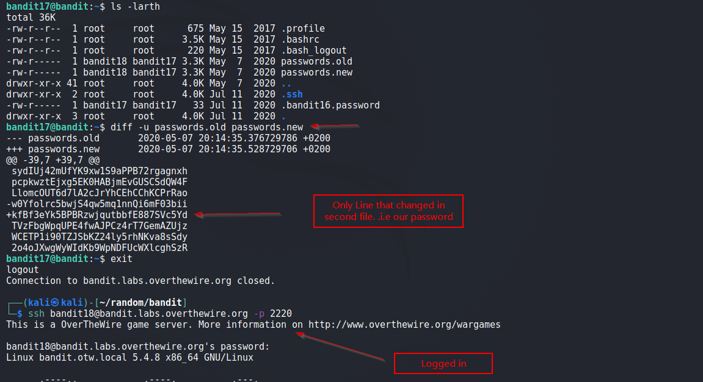

# Bandit

## Level 17
There are 2 files in the homedirectory: passwords.old and passwords.new. The password for the next level is in passwords.new and is the only line that has been changed between passwords.old and passwords.new

NOTE: if you have solved this level and see ‘Byebye!’ when trying to log into bandit18, this is related to the next level, bandit19

 
## Solution
We can see 2 files `password.old` and `passoword.new` in our home directory.

We use `diff` to see the difference in the files and get password for next Level.

 
Solution Screenshot:

 

[<< Back](https://grey-fish.github.io/Bandit/index.html)
