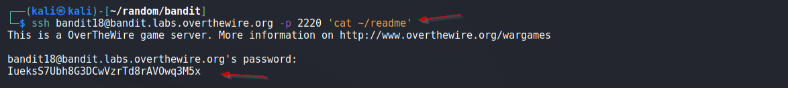
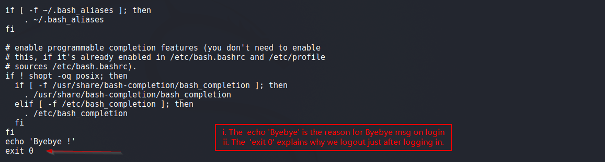

# Bandit

## Level 18
The password for the next level is stored in a file readme in the homedirectory. Unfortunately, someone has modified .bashrc to log you out when you log in with SSH.

<br/>
## Solution
This seems interesting. As stated above, when we login using our credentials, we are immediately logged out.

We can solve this level by providing a <u>command</u> while logging in via SSH

From the SSH Docs:
> If a command is specified, it is executed on the remote host instead of a login shell

Our Final Command:
```shell
$ ssh bandit18@bandit.labs.overthewire.org -p 2220 'cat ~/readme'
```

<br/>
Solution Screenshot:



<br/>
We have the password for next Level, just for our curiosity, lets see what changes were made in `.bashrc` file.

Command used:
```shell
$ ssh bandit18@bandit.labs.overthewire.org -p 2220 'cat ~/.bashrc' 
```

Below is output of above command, the end part of our `.bashrc` contains some changes:



This was Level 18.

<br/>

[<< Back](https://grey-fish.github.io/Bandit/index.html)
