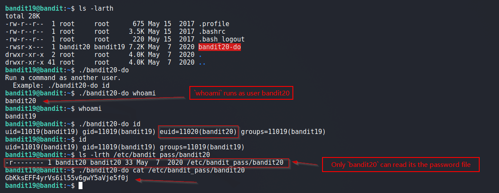

# Bandit

## Level 19
To gain access to the next level, you should use the setuid binary in the homedirectory. Execute it without arguments to find out how to use it. The password for this level can be found in the usual place (/etc/bandit_pass), after you have used the setuid binary

<br/>
## Solution

The executables with setuids set are major source of privesc.<br/> 
Below we see that even though we are logged in as `bandit19`, the executable `bandit20-do` allows us to execute commands as user `bandit20`.

As we can execute command as `bandit20` and only `bandit20` can view its password file, hence we get the password.

<br/>
Final Command:
```shell
$ ./bandit20-do cat /etc/bandit_pass/bandit20
```

<br/>
Screenshot:



<br/>
<span id=green>**Takeaway**</span><br/>

  - Setuids are great for permissions, but when configured incorrectly, aid in privilege escalation.<br/>

<br/>

[<< Back](https://grey-fish.github.io/Bandit/index.html)
