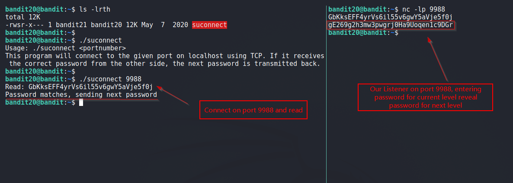

# Bandit

## Level 20
There is a setuid binary in the homedirectory that does the following: it makes a connection to localhost on the port you specify as a commandline argument. It then reads a line of text from the connection and compares it to the password in the previous level (bandit20). If the password is correct, it will transmit the password for the next level (bandit21).

 
## Solution

The `suconnect` executable connects to a port number we specify and reveals password for next level if correct password of current level is given.

So, First lets listen on a port using `nc` and have `suconnect` connect to it. If we give correct password for current level, then password of next level will be revealed.

 
Solution Screenshot with 2 concurrent session:

 
**Takeaway** 

  - If `nc -l <port_num> doesn't work, try `nc -lp <port_num>`. 

 

[<< Back](https://grey-fish.github.io/Bandit/index.html)
