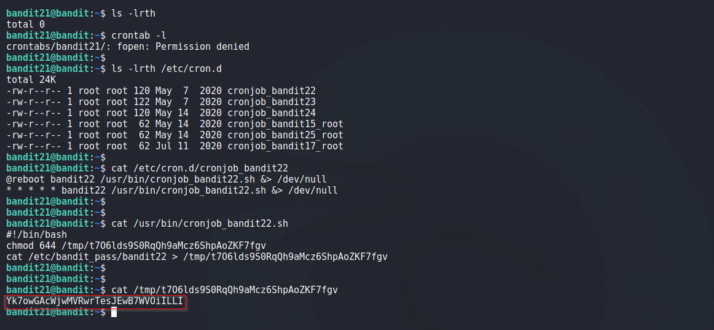

# Bandit

## Level 21

A program is running automatically at regular intervals from cron, the time-based job scheduler. Look in /etc/cron.d/ for the configuration and see what command is being executed.

<br/>
## Solution

Contents of /etc/cron.d:
```shell
bandit21@bandit:~$ ls -lrth /etc/cron.d
total 24K
-rw-r--r-- 1 root root 120 May  7  2020 cronjob_bandit22
-rw-r--r-- 1 root root 122 May  7  2020 cronjob_bandit23
-rw-r--r-- 1 root root 120 May 14  2020 cronjob_bandit24
-rw-r--r-- 1 root root  62 May 14  2020 cronjob_bandit15_root
-rw-r--r-- 1 root root  62 May 14  2020 cronjob_bandit25_root
-rw-r--r-- 1 root root  62 Jul 11  2020 cronjob_bandit17_root
```

<br/>
Lets see what is in file `cronjob_bandit22`
```shell
#!/bin/bash
chmod 644 /tmp/t7O6lds9S0RqQh9aMcz6ShpAoZKF7fgv
cat /etc/bandit_pass/bandit22 > /tmp/t7O6lds9S0RqQh9aMcz6ShpAoZKF7fgv
```

Above script outputs password of next Level to the file mentioned in `tmp` dir and is readable. So we get our password

<br/>
Solution Screenshot:



<br/>

[<< Back](https://grey-fish.github.io/Bandit/index.html)
