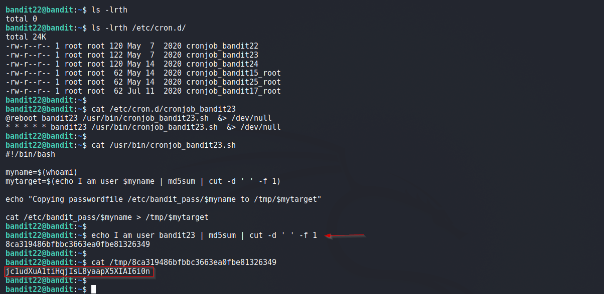

# Bandit

## Level 22
A program is running automatically at regular intervals from cron, the time-based job scheduler. Look in /etc/cron.d/ for the configuration and see what command is being executed

<br/>
## Solution

Again, we find a script present in `/etc/cron.d/` directory for user bandit23.

Below is the script. Adding comments
```shell
#!/bin/bash

myname=$(whoami)                # This will be bandit23
mytarget=$(echo I am user $myname | md5sum | cut -d ' ' -f 1)      # Convert a string containing usernae to md5

echo "Copying passwordfile /etc/bandit_pass/$myname to /tmp/$mytarget"  

cat /etc/bandit_pass/$myname > /tmp/$mytarget  # Copy password for bandit23 to /tmp/<above_hash>

```

Above we can see that password for next level is stored in `/tmp/<hash>` file. Lets find out the `<hash>` value.
  
See Below:
```shell
# Getting the hash value manually
$ echo I am user bandit23 | md5sum | cut -d ' ' -f 1
8ca319486bfbbc3663ea0fbe81326349
```

Now we find passoword for next Level in `/tmp/8ca319486bfbbc3663ea0fbe81326349` file.
  
<br/>
Solution Screenshot:



<br/>

[<< Back](https://grey-fish.github.io/Bandit/index.html)
