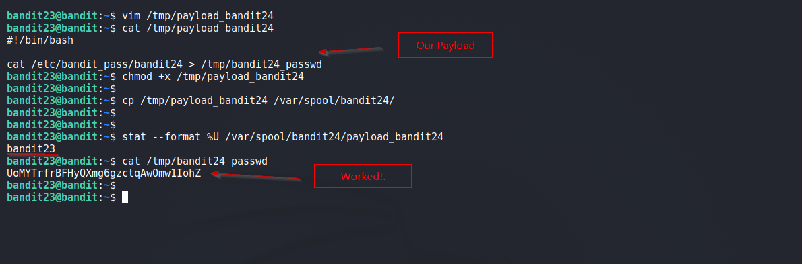

# Bandit

## Level 23
A program is running automatically at regular intervals from cron, the time-based job scheduler. Look in /etc/cron.d/ for the configuration and see what command is being executed.

<br/>

## Solution
Again, we find a script present in `/etc/cron.d/` directory for user bandit24.

Content of `/usr/bin/cronjob_bandit24.sh`
```shell
$ cat /usr/bin/cronjob_bandit24.sh 
#!/bin/bash

myname=$(whoami)

cd /var/spool/$myname
echo "Executing and deleting all scripts in /var/spool/$myname:"
for i in * .*;
do
    if [ "$i" != "." -a "$i" != ".." ];
    then
        echo "Handling $i"
        owner="$(stat --format "%U" ./$i)"
        if [ "${owner}" = "bandit23" ]; then
            timeout -s 9 60 ./$i
        fi
        rm -f ./$i
    fi
done
```

Breakdown of Above Script: <br/>

  - Look for a file owned by user `bandit23` in `/var/spool/bandit24`<br/>
  - If its there, run that file and terminate it if it runs for more than 60 seconds

Below steps were taken to reveal password for next Level:

1. Create a file `/tmp/payload.sh` file (<em>logged in as bandit23</em>).
2. Put a simple command to output password in this file.
```shell
#!/bin/bash

cat /etc/bandit_pass/bandit24 > /tmp/bandit24_passwd
```
3. Make the file executable using `chmod` and copy to `/var/spool/bandit24` directory.
3. Wait, cronjob will run `payload.sh` as user bandit24 and then delete it.
4. As result, we can find the password in `/tmp/bandit24_passwd` file.

<br/>
Solution Screenshot:



<br/>

[<< Back](https://grey-fish.github.io/Bandit/index.html)
