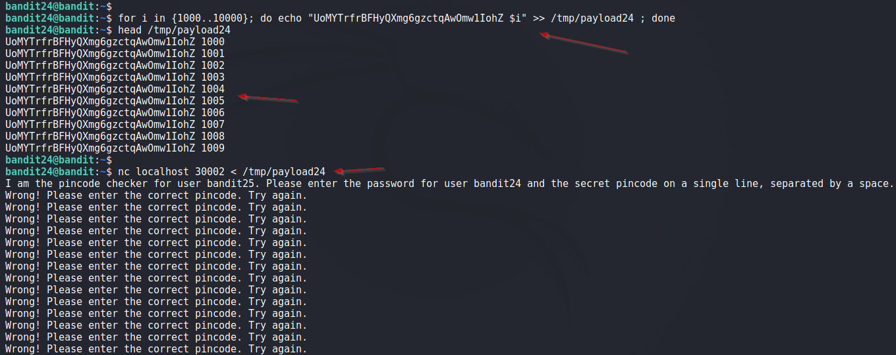
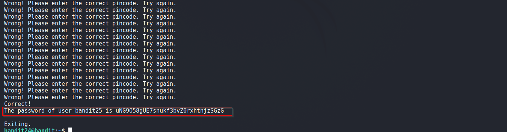

# Bandit

## Level 24
A daemon is listening on port 30002 and will give you the password for bandit25 if given the password for bandit24 and a secret numeric 4-digit pincode. There is no way to retrieve the pincode except by going through all of the 10000 combinations, called brute-forcing.

<br/>
## Solution
We have to perform a bruteforce to get password for next Level.

First, lets connect using netcat.

```shell
bandit24@bandit:~$ nc localhost 30002                                                                                                                                
I am the pincode checker for user bandit25. Please enter the password for user bandit24 and the secret pincode on a single line, separated by a space.               
UoMYTrfrBFHyQXmg6gzctqAwOmw1IohZ 0000                                                                                                                                
Wrong! Please enter the correct pincode. Try again.                                                                                                                  
UoMYTrfrBFHyQXmg6gzctqAwOmw1IohZ 1111                                                                                                                                
Wrong! Please enter the correct pincode. Try again.                                                                                                                  
Timeout. Exiting. 
```

We will generate a file containing password and all possible 4 digits numbers. This is done using below one liner.

```shell
bandit24@bandit:~$ for i in {1000..10000}; do echo "UoMYTrfrBFHyQXmg6gzctqAwOmw1IohZ $i" >> /tmp/payload24 ; done
```

Now provide this file as input to netcat and this will reveal password for next Level.

Final Command:
```shell
bandit24@bandit:~$ nc localhost 30002 < /tmp/payload24
```

Solution Screenshot:





<br/>

[<< Back](https://grey-fish.github.io/Bandit/index.html)
