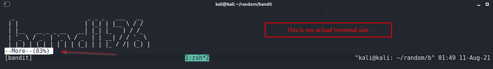
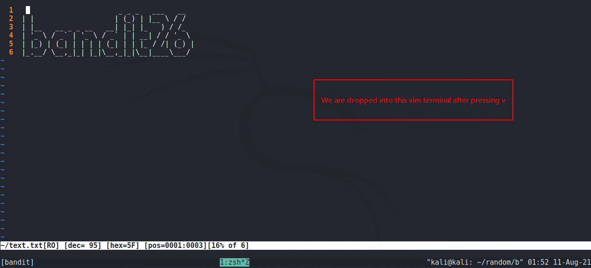
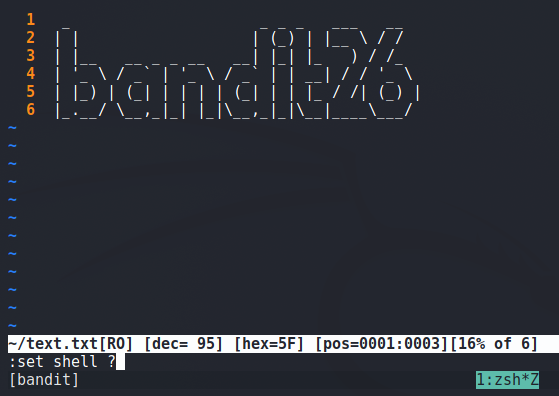
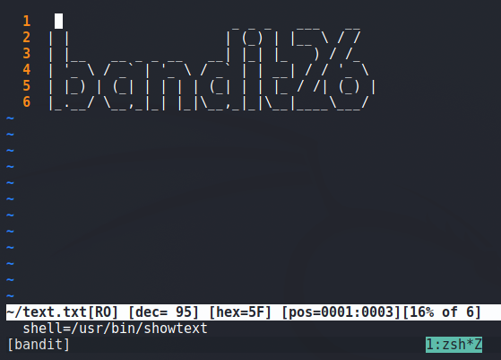
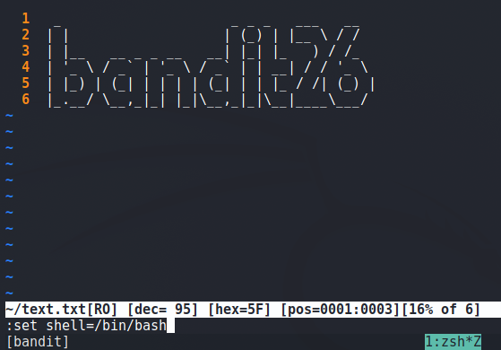
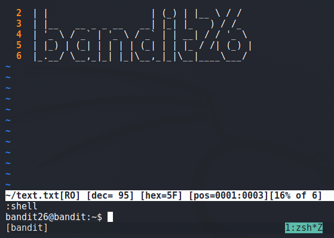

# Bandit

## Level 25
Logging in to bandit26 from bandit25 should be fairly easy… The shell for user bandit26 is not /bin/bash, but something else. Find out what it is, how it works and how to break out of it.

<br/>
## Solution
I vividly remember even after an year, how this Level astonished me. Personally for me this Level is the best one in Bandit and embraces the Hacker Spirit.

We Log in as user bandit25, and we see a private SSH key for bandit26 user. So we login using the private SSH key as user bandit26, and we are displayed a text and logged out.

Q: Why does this happen? <br/>
A: Default shell for bandit26 is changed to a custom shell script `/usr/bin/showtext`. 

See Below:
```shell
bandit25@bandit:~$ cat /etc/passwd | grep bandit26
bandit26:x:11026:11026:bandit level 26:/home/bandit26:/usr/bin/showtext          <----
bandit25@bandit:~$ cat /usr/bin/showtext
#!/bin/sh

export TERM=linux

more ~/text.txt
exit 0
```
So, whenever bandit26 logs in, `/usr/bin/showtext` runs and user gets logged out due to `exit 0` command.


Our Objective is to get the shell. Here is how we do it.
Look at the contents of `/usr/bin/showtext`, there is a `more` command, we can use it to execute external commands.

From `more` docs:
>  v         Start up an editor at current line.  The editor is taken from the environmentvariable VISUAL if defined,<br/>
>            or EDITOR if VISUAL is not defined,  or  defaults to vi if neither VISUAL nor EDITOR is defined.

In order to do that, shrink the terminal size and login so that we can get command bar at end and then press v. See below:



Now as per docs, press `v` and we be dropped into a terminal. Now we can bring terminal to normal size.



Under normal conditions, we would be able to type `:shell` from vim and would be dropped into a shell, but its not the case here. 
Lets see what is our `shell` variable set to and change it.

  --->  

We an see its, `/usr/bin/showtext`.

We change it to `/bin/bash` and execute `:shell` and we are dropped into a proper shell !

  --->  

We have successfully completed the level and gained shell.

<br/>
<span id=green>**Takeaway**</span><br/>

  - .<br/>

<br/>

[<< Back](https://grey-fish.github.io/Bandit/index.html)
