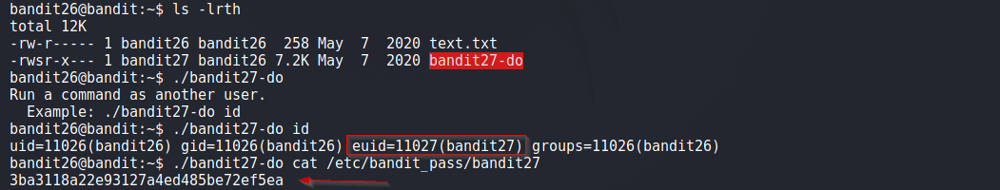

# Bandit

## Level 26

Good job getting a shell! Now hurry and grab the password for bandit27!

 
## Solution

After getting shell for bandit26, we look in our home directory and find an executable.

The executable `bandit27-do` has suid bit set and lets us execute command as user bandit27.

Now it's an easy task of just using it to read the password file .i.e. `/etc/bandit_pass/bandit27`.

 
Solution Screenshot:

 

[<< Back](https://grey-fish.github.io/Bandit/index.html)

