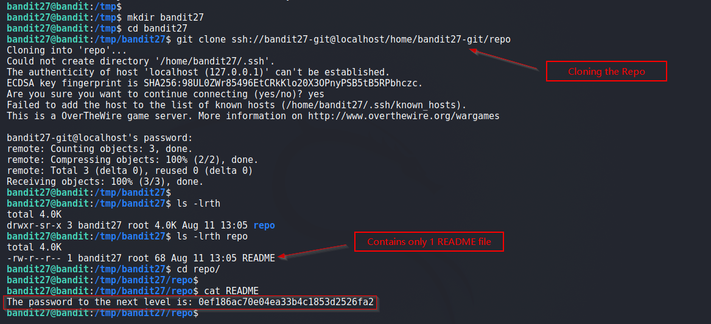

# Bandit

## Level 27

There is a git repository at ssh://bandit27-git@localhost/home/bandit27-git/repo. The password for the user bandit27-git is the same as for the user bandit27.

Clone the repository and find the password for the next level.

 
## Solution
Our task is simple, clone the repo and find the password.

We use `git clone` to clone a local repo. It contains only one file with password for next Level. 

 
Solution Screenshot:

 

[<< Back](https://grey-fish.github.io/Bandit/index.html)
