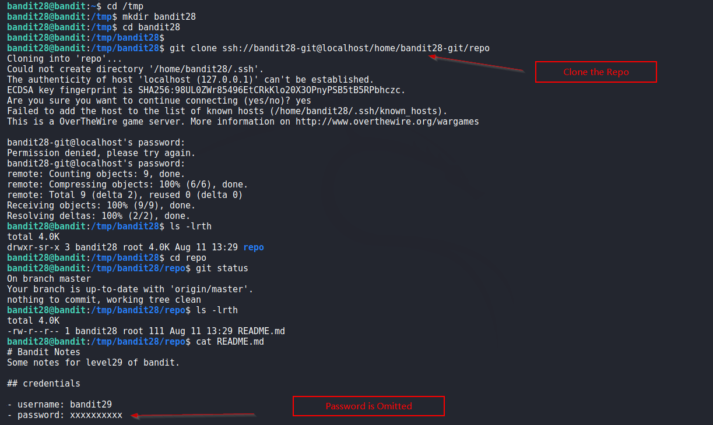
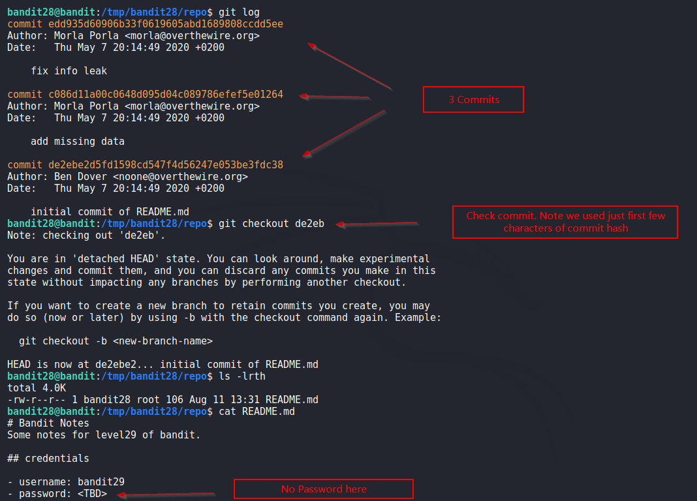
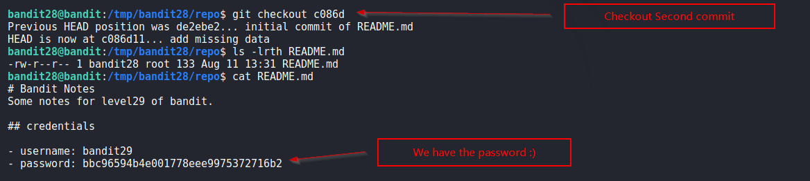

# Bandit

## Level 28
There is a git repository at ssh://bandit28-git@localhost/home/bandit28-git/repo. The password for the user bandit28-git is the same as for the user bandit28.

Clone the repository and find the password for the next level.

<br/>
## Solution

Again, we clone the repo in `/tmp` directory. But this time password isn't in the README file.

Screenshot:



<br/>
Perhaps the password was there sometime in the past. So we check the `git log`.  Here's the output

```shell
$ git log                                     
commit edd935d60906b33f0619605abd1689808ccdd5ee                                 
Author: Morla Porla <morla@overthewire.org>                                     
Date:   Thu May 7 20:14:49 2020 +0200   

    fix info leak                       

commit c086d11a00c0648d095d04c089786efef5e01264                                 
Author: Morla Porla <morla@overthewire.org>                                     
Date:   Thu May 7 20:14:49 2020 +0200   

    add missing data                    

commit de2ebe2d5fd1598cd547f4d56247e053be3fdc38                                 
Author: Ben Dover <noone@overthewire.org>                                       
Date:   Thu May 7 20:14:49 2020 +0200   

    initial commit of README.md      
```

We have 3 commits, inspect these using `git checkout` command which restores the working tree depending upon the HEAD. Simply put it restores the repo to a state when commit was made.<br/>
We find that password was present in second commit and removed afterwards.

<br/>
Solution Screenshot:





Nice!!!

<br/>
<span id=green>**Takeaway**</span><br/>

  - Never store password in git repo files, they can be accessed even after removal<br/>

<br/>

[<< Back](https://grey-fish.github.io/Bandit/index.html)


