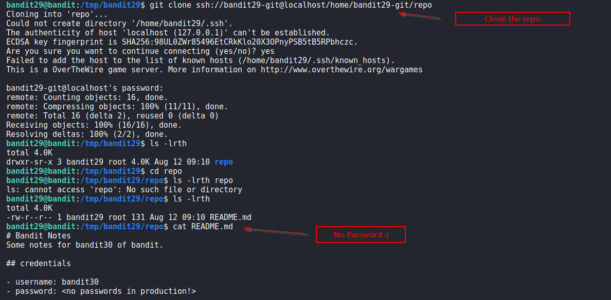
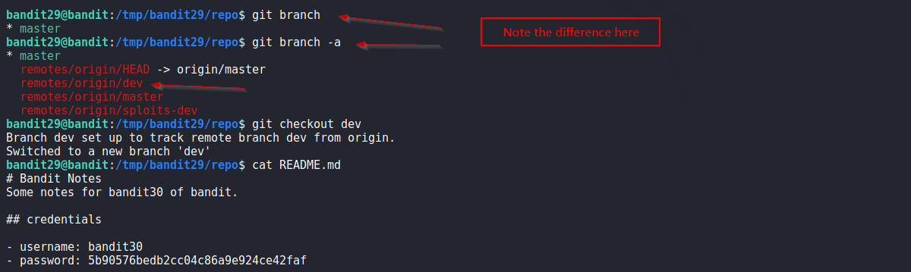

# Bandit

## Level 29

There is a git repository at ssh://bandit29-git@localhost/home/bandit29-git/repo. The password for the user bandit29-git is the same as for the user bandit29.

Clone the repository and find the password for the next level.

 
## Solution

Create a directory in `/tmp` and clone the repo there. Checked `git log` as well, no password found. 

Screenshot:

 
After further playing and digging, i found that there is a remote branch `dev` added to it.  
Note: Remote branches are visible in `git branch -a` and not in `git branch`, it lists only local branches.

From the docs:
> If --list is given, or if there are no non-option arguments, existing branches are listed; the current branch will be highlighted in green and marked with an asterisk. Any branches checked out in linked worktrees will be highlighted in cyan and marked with a plus sign. Option -r causes the remote-tracking branches to be listed, and option -a shows both local and remote branches.

So, switch to the remote branch `dev` and we found password in README file.

 
Solution Screenshot:

 
**Takeaway** 

  - List all branches (local and remote) in a repo using `git branch -a` .  

 

[<< Back](https://grey-fish.github.io/Bandit/index.html)

