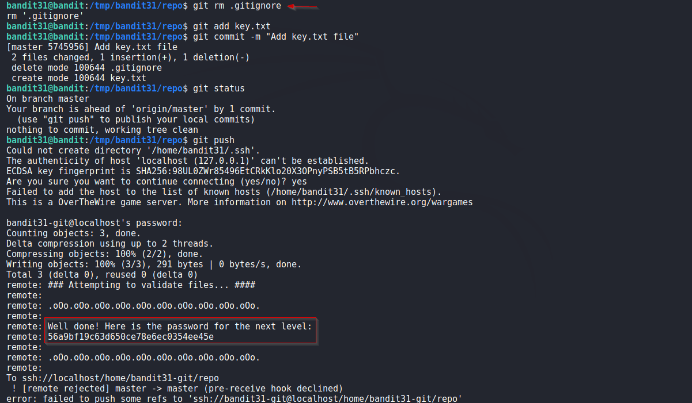

# Bandit

## Level 31
There is a git repository at ssh://bandit31-git@localhost/home/bandit31-git/repo. The password for the user bandit31-git is the same as for the user bandit31.

Clone the repository and find the password for the next level.

<br/>
## Solution

We clone the repo and we are given following message in README file

```
This time your task is to push a file to the remote repository.

Details:
    File name: key.txt
    Content: 'May I come in?'
    Branch: master
```

Seems easy but when we create a text file `key.txt` and push it, we get the following error.

```
The following paths are ignored by one of your .gitignore files:
key.txt
Use -f if you really want to add them.
```

According to error, we `.gitignore` file is causing issues. Check its content and we know why.<br/>
`.gitignore` file's content

```
*.txt
```

So i just remove the `.gitignore` file and push the `key.txt` file again and this reveals the password.

<br/>
Solution Screenshot:



<br/>

[<< Back](https://grey-fish.github.io/Bandit/index.html)


