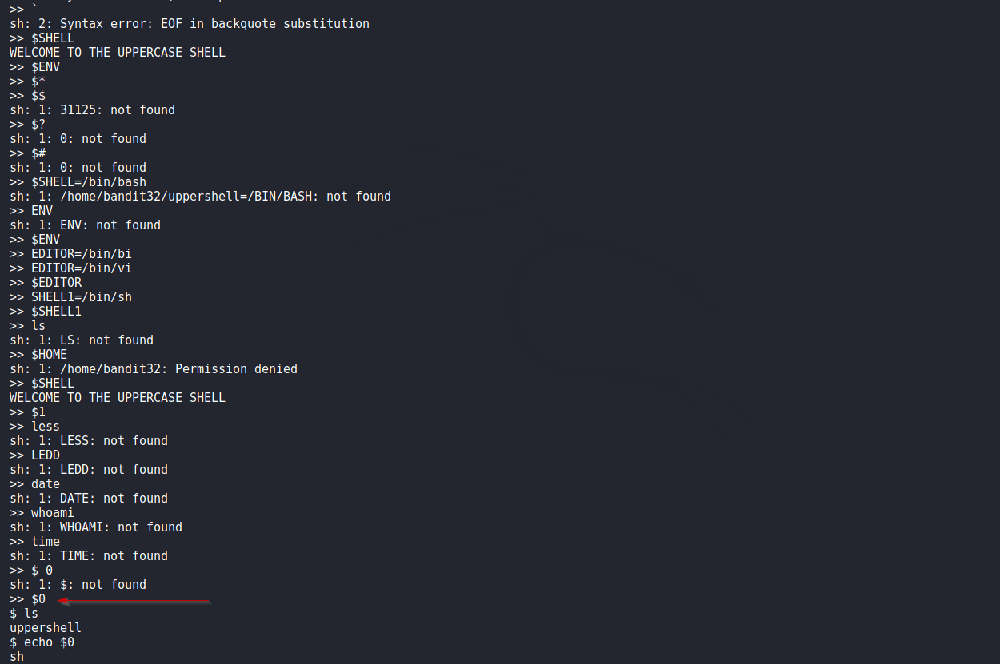
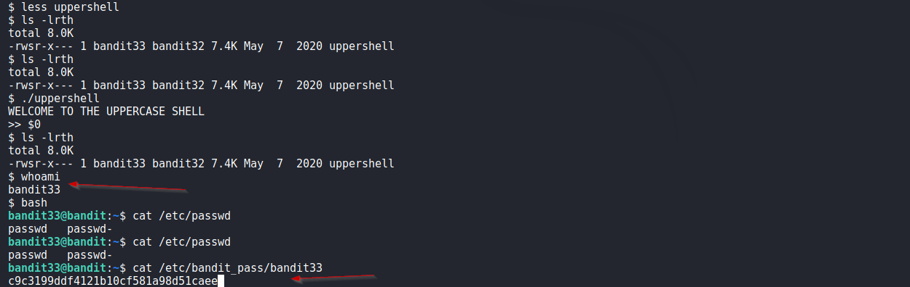

# Bandit

## Level 32
After all this git stuff its time for another escape. Good luck!

 
## Solution

We login as bandit32 and are dropped in a custom shell named `uppershell` and as its name suggests, it turns every command to uppercase.

After lot of trial and error, managed to escape it using `$0` variable.  Below is an image of some of the failed attempts and then escape.

We get the password for next Level.

 

[<< Back](https://grey-fish.github.io/Bandit/index.html)
