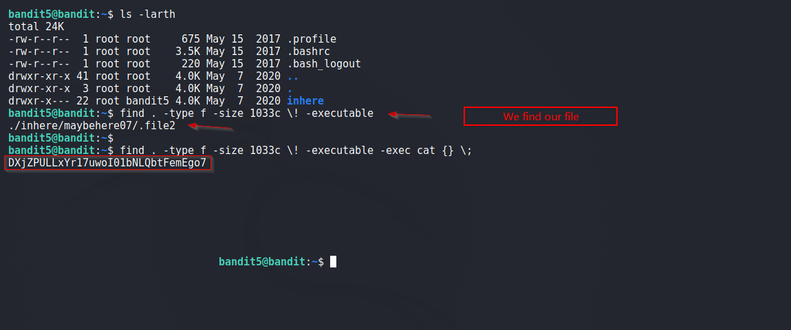

# Bandit

## Quest
The password for the next level is stored in a file somewhere under the inhere directory and has all of the following properties:
    human-readable
    1033 bytes in size
    not executable
 
## Solution
We find the file using `find` command and pass the following option: 

  - human-readable      `-type f` 
  - 1033 bytes          `-size 1033c`      <em># Note the `c` at the end</em> 
  - not executable     `\! -executable` 

Below we find the file and password for next Level.

 

[<< Back](https://grey-fish.github.io/Bandit/index.html)
