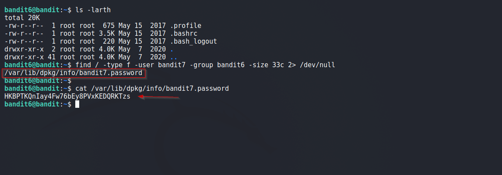

# Bandit

## Level 6
The password for the next level is stored somewhere on the server and has all of the following properties:<br/>
  - owned by user bandit7<br/>
  - owned by group bandit6<br/>
  - 33 bytes in size<br/>

<br/>
## Solution

Again we use the `find` command to find the file.

  - owned by user bandit7        `-user bandit7`<br/>
  - owned by group bandit6       `-group bandit6`<br/>
  - size of 33 bytes              `-size 33c`<br/>
<br/>
Final Command:
```shell
$ find / -type f -user bandit7 -group bandit6 -size 33c 2> /dev/null
```
<br/>
Solution Screenshot



<br/>
<span id=green>**Takeaway**</span><br/>

  - Always refer the manual for various options like `-user` etc.<br/>
  - Send errors to `/dev/null`, else our terminal would be cluttered<br/>

<br/>

[<< Back](https://grey-fish.github.io/Bandit/index.html)
