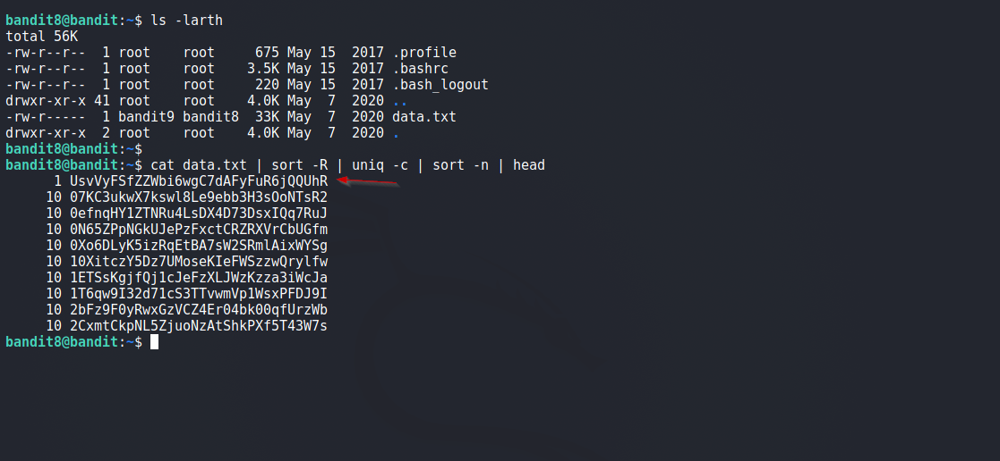

# Bandit

## Level 8
The password for the next level is stored in the file data.txt and is the only line of text that occurs only once

<br/>
## Solution
Our task is to find a line that occurs only once in a file.

<br/>
Final Command:
```shell
$ cat data.txt | sort -R | uniq -c | sort -n | head
```

Breakdown:

  - `cat data.txt | `      Output contents of file<br/>
  - `sort -R |`           Group identical entries together<br/>
  - `uniq -c |`           Print the identical count<br/>
  - `sort -n |`           Numeric Sort, ascending order<br/>
  - `head`                 Print first 10 entries<br/>

Above command prints number of times a unique line occurs in a file, result is sorted numerically.

<br/>
Solution Screenshot:



<br/>
<span id=green>**Takeaway**</span><br/>

  - Chaining commands = win <br/>

<br/>

[<< Back](https://grey-fish.github.io/Bandit/index.html)
