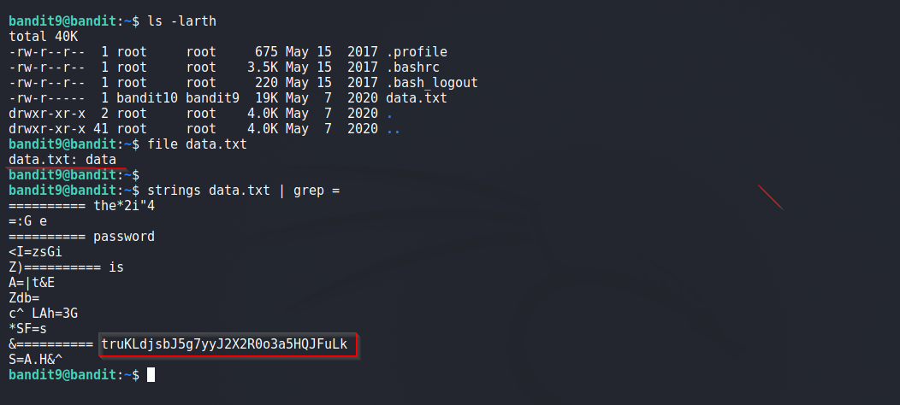

# Bandit

## Level 9
The password for the next level is stored in the file data.txt in one of the few human-readable strings, preceded by several ‘=’ characters.

<br/>
## Solution
Inspecting the file using `file` command reveals that it is a binary file.

We make use of `strings` command to extract strings from a binary file and grep for password.

<br/>
Final Command:
```shell
$ strings data.txt | grep =
```
<br/>
Solution Screenshot



<br/>
<span id=green>**Takeaway**</span><br/>

  - Use `strings` command to read strings in a binary.<br/>

<br/>

[<< Back](https://grey-fish.github.io/Bandit/index.html)
