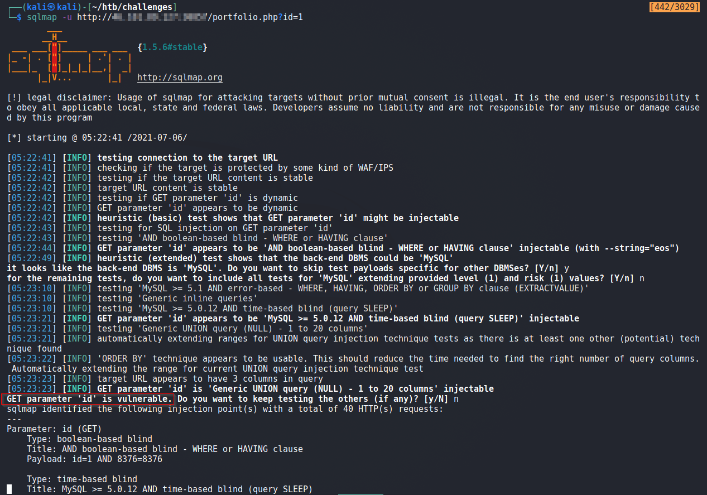
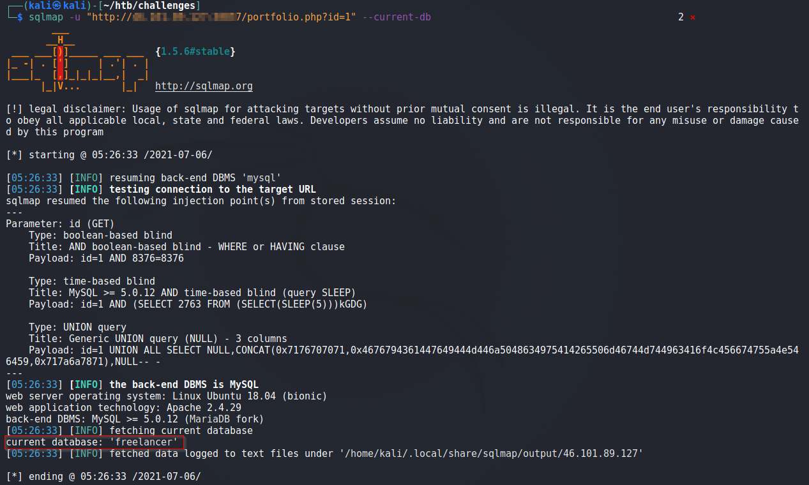
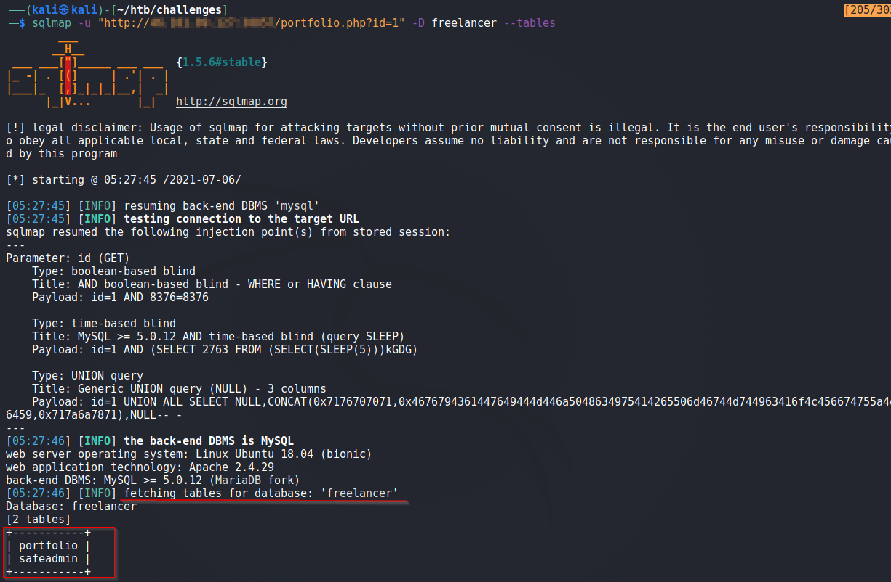
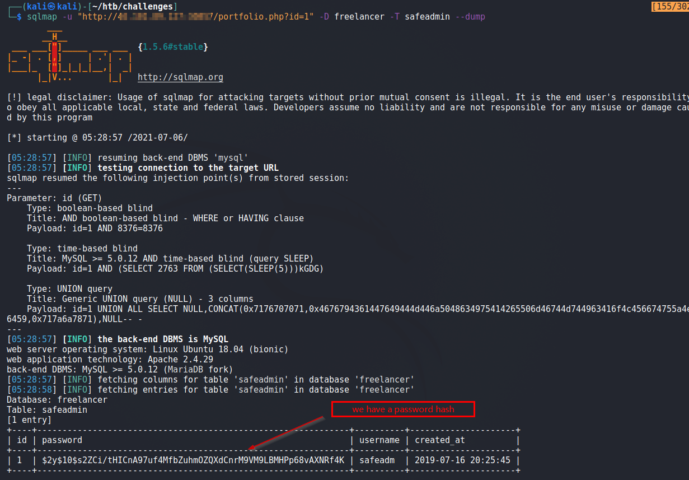
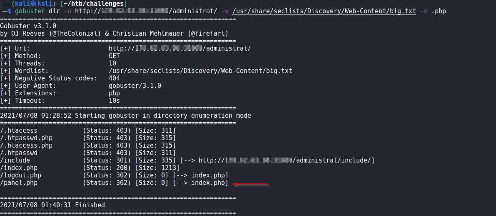
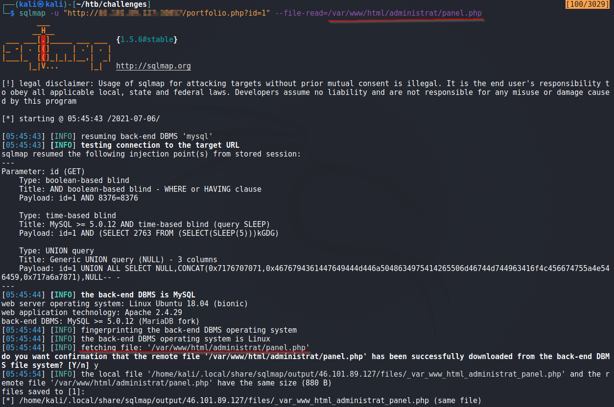
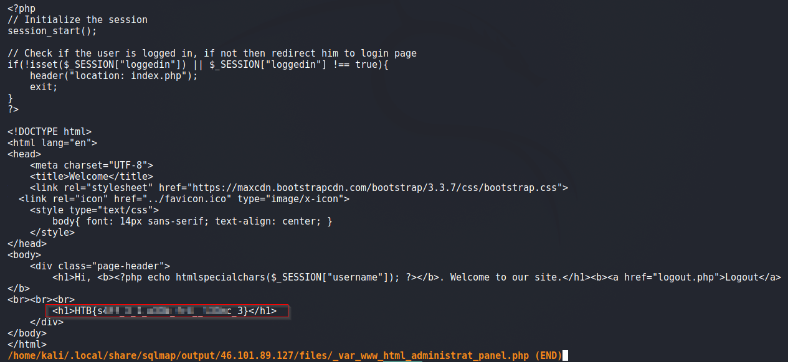

# Freelancer
>Name : Freelancer 
>tags : web 
>Solved: 06 July 2021 

## Intro
A message from creater :  _"Can you test how secure my website is? Prove me wrong and capture the flag!"_

 

## Solution
We are presented with a website, Lets run `gobuster` on it.

We find following interesting directories

  - `/administrat`  : presents a login form 
  - `/mail`      : contains `contact_me.php` file which yields 500 Internal error. 

Analyzing the source for main page reveals a link `portfolio.php?id=1`.

We run `sqlmap` and see that parameter `id` is injectible.

 

Alright, we extract the Database name  : `freelancer` below

 

Dumping tables of DB `freelancer`

 

The `safeadmin` table looks interesting, lets dump its content.

Above we extracted the password hash, but i was unable to break it. So moving on.

 

Moving ahead, while further bruteforing the `/administrat` directory, `panel.php` was found

 

When we try to access `panel.php`, we are redirected to the index page. Lets read it's code using `sqlmap`

 

In the `panel.php`, we find our flag.

That is the challenge !

 

[<< Back](https://grey-fish.github.io/HTB/index.html)

