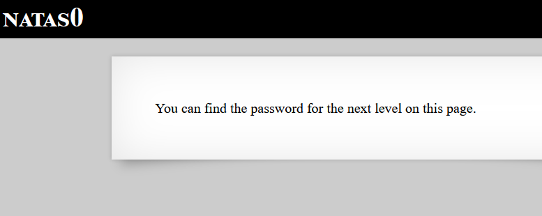

# Level 1
Level 1 is fairly simple. 

## Quest 
We are greeted with a similar page but with right click disabled.

 

## Solution
Inspite of right click being disabled, we can view the source code of webpage using the developers console in our browser (_in Elements tab_), which reveals the password for next Level.

<dl>
<dt>Note</dt>
<dd>Password would have been also clearly visible if we were using a proxy like Burp.</dd>
</dl>

 

[<< Back](https://grey-fish.github.io/Natas/index.html)
