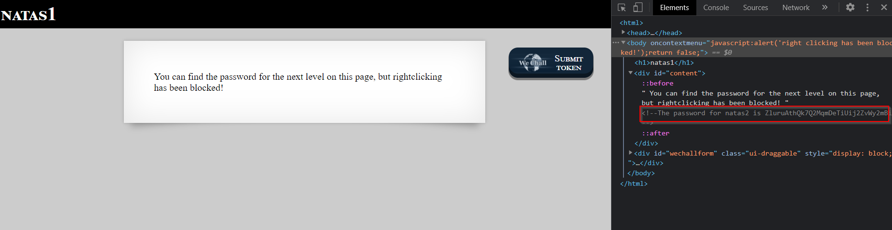

# Level 1
Level 1 is fairly simple. 

## Quest 
We are greeted with below page.

 

## Solution
Its fairly simple. The password is in the source code of the page.

<dl>
<dt>Note</dt>
<dd>Password will be clearly visible if we are using a proxy like Burp.</dd>
</dl>

 

[<< Back](https://grey-fish.github.io/Natas/index.html)
