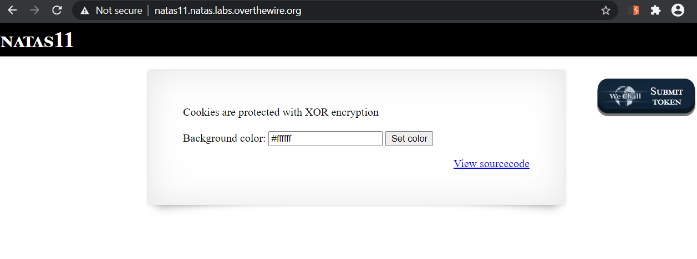
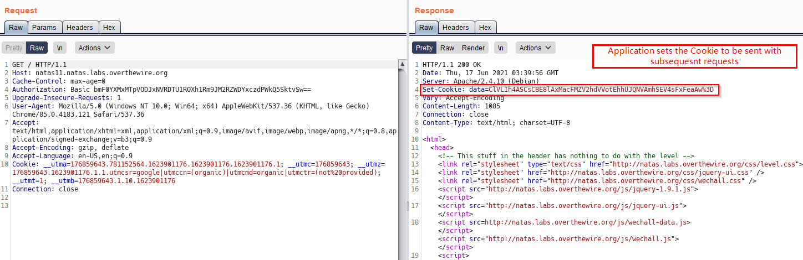
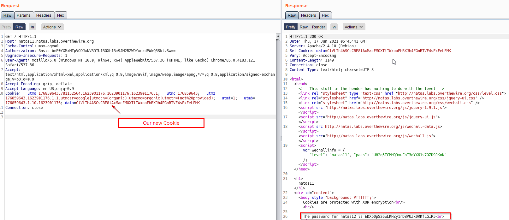

# Natas Level 11
This is a tricky one and challenging, it does require elaborate explanation.

## Quest
We are presented with below webpage.



Below is the backened code (its quite a lot), i'll put in some comments for now and break it down later.
```php
<?
$defaultdata = array( "showpassword"=>"no", "bgcolor"=>"#ffffff");

function xor_encrypt($in) { // This function XOR encrypts data
    $key = '<censored>';
    $text = $in;
    $outText = '';

    // Iterate through each character
    for($i=0;$i<strlen($text);$i++) {
    $outText .= $text[$i] ^ $key[$i % strlen($key)];
    }

    return $outText;         // Return the encrypted data
}

function loadData($def) {
    global $_COOKIE;
    $mydata = $def;
    if(array_key_exists("data", $_COOKIE)) {   // If data key exists in Cookie,
    $tempdata = json_decode(xor_encrypt(base64_decode($_COOKIE["data"])), true);    // This line decodes the data , $tempdata is an array (see below line)
    if(is_array($tempdata) && array_key_exists("showpassword", $tempdata) && array_key_exists("bgcolor", $tempdata)) {  //checkis if 2 keys 'showpassword' and 'bgcolor' exist
        if (preg_match('/^#(?:[a-f\d]{6})$/i', $tempdata['bgcolor'])) {
        $mydata['showpassword'] = $tempdata['showpassword'];
        $mydata['bgcolor'] = $tempdata['bgcolor'];
        }
    }
    }
    return $mydata;
}

function saveData($d) {    // Sets the Cookie for the user
    setcookie("data", base64_encode(xor_encrypt(json_encode($d))));
}

$data = loadData($defaultdata);  // Uses defaultdata array

if(array_key_exists("bgcolor",$_REQUEST)) {
    if (preg_match('/^#(?:[a-f\d]{6})$/i', $_REQUEST['bgcolor'])) {  // This regex matches color code string like #abcdd2
        $data['bgcolor'] = $_REQUEST['bgcolor'];
    }
}

saveData($data);
?>

<h1>natas11</h1>
<div id="content">
<body style="background: <?=$data['bgcolor']?>;">
Cookies are protected with XOR encryption<br/><br/>

<?
if($data["showpassword"] == "yes") {
    print "The password for natas12 is <censored><br>";
}
?>
```
<br/>

## Solution
Before diving into the code, here is request and response in Burp




First, i'll layout the code flow (removing function definitions)<br/>
    1. Declare default array : `["showpassword"=>"no", "bgcolor"=>"#ffffff"]`<br/>
    2. Call `loadData` and save its output to variable `$data`<br/>
    3. Modify `$data[bgcolor]` value as recieved in the request.<br/>
    4. Call `SaveData` function with `$data` as argument to Set the Cookie<br/>
    5. Lastly, if `$data["showpassword"] == "yes"`, then reveal the password for next level.<br/>
    
Observation:<br/>
    We can say that to reveal the password, `$data` should contain `["showpassword"=>"yes", "bgcolor"=>"#ffffff"]`<br/>
    Now `$data` gets its value from `loadData` function, so lets take a look at it.<br/>

`loadData` takes in the `defaultarray` and if no Cookie is present in the request, it returns the same default array. But in case a Cookie is sent, the Cookie is decrypted and an array is constructed, which is then returned. So, to change value of `$data` we set a cookie with value as `["showpassword"=>"yes", "bgcolor"=>"#ffffff"]`

Onto the next part, we can't set cookie directly like above as it is XOR encrypted, So we look at XOR encryption function.
Look at this [Wiki page](https://en.wikipedia.org/wiki/XOR_cipher) to understand more.<br/>Simply put, The binary operation XOR (eXclusive OR) will compare two bits and will produce one bit in return. That bit will be equal to 1 if two compared bits were different, 0 if they were equal. 
```
We A ^ B Below to produce C     // ^ denotes XOR

A -> 00110101 01101010      // lets say with is our text  (plaintext)
B -> 00001110 10100010      //  this is our key           ( key     )
----------------------
C -> 00111011 11001000      // Our encrypted output       ( cipher  )
----------------------

Now, above, A^B = C . According to XOR property,  C^A = B  or C^B = A 
If we know A and C, we can get back B, which is our "key", by simply doing a XOR again with A. (shown below)

C -> 00111011 11001000
A -> 00110101 01101010
----------------------
B -> 00001110 10100010      // Here we get our key back, if we XOR cipher with plaintext again
----------------------
```

<br/>At this moment, we know A (plaintext, i.e. array) and C (Ciphertext, i.e cookie data). Now we will use the xor encrypt function to get B .i.e. key

```php
$A = json_encode(array( "showpassword"=>"no", "bgcolor"=>"#ffffff"));   
$C = base64_decode("ClVLIh4ASCsCBE8lAxMacFMZV2hdVVotEhhUJQNVAmhSEV57Q0ReaAw=");  // Cookie taken from burp
// Above we removed the preprosessing before XORing as same happens in source code.

// Copied code from sourcecode and modified slightly
function xor_encrypt($in, $key) {
    $text = $in;
    $outText = '';

    // Iterate through each character
    for($i=0;$i<strlen($text);$i++) {
    $outText .= $text[$i] ^ $key[$i % strlen($key)];
    }

    return $outText;
}

echo xor_encrypt($C, $A);   // gives output qw8Jqw8Jqw8Jqw8Jqw8Jqw8Jqw8Jqw8J

// This is our key as to do xor 'qw8J' is repreated
```

<br/>Now that we have key, .i.e. B and we know A, we can create a valid new C

```php
$newA = json_encode(array( "showpassword"=>"yes", "bgcolor"=>"#ffffff"));
$B = 'qw8J';

echo xor_encrypt($newA, $B);    // UK"H+O%pS]9S[(W&pST^,^,S

// Now we base64 encode it 
echo base64_encode(xor_encrypt($newA, $B));   // ClVLIh4ASCsCBE8lAxMacFMOXTlTWxooFhRXJh4FGnBTVF4sFxFeLFMK

// This is our Cookie
```

<br/>Using Burp Repeater, send our newly created C as the Cookie, which reveals the password as seen below.



<br/>

[<< Back](https://grey-fish.github.io/Natas/index.html)
