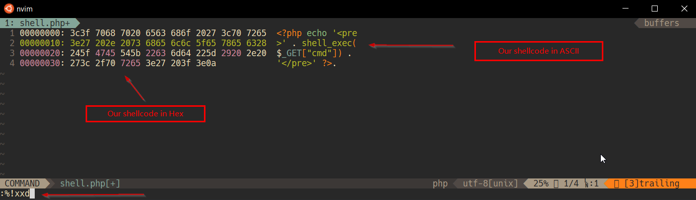
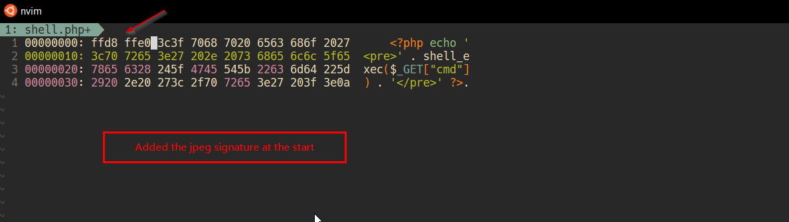

# Level 13
Learned new tricks while solving this level. It's good.

## Quest
We are presented with a webpage similar to previous level, but with additional message. 


The backened code is exactly like previous level, except one change, i'll highlight that below
```php
if(array_key_exists("filename", $_POST)) {
    $target_path = makeRandomPathFromFilename("upload", $_POST["filename"]);
    
    $err=$_FILES['uploadedfile']['error'];
    if($err){
        if($err === 2){
            echo "The uploaded file exceeds MAX_FILE_SIZE";
        } else{
            echo "Something went wrong :/";
        }
    } else if(filesize($_FILES['uploadedfile']['tmp_name']) > 1000) {
        echo "File is too big";
    } else if (! exif_imagetype($_FILES['uploadedfile']['tmp_name'])) { // Here is the difference, they use exif_imagetype 
        echo "File is not an image";                                    // to check uploaded image
    } else {
        if(move_uploaded_file($_FILES['uploadedfile']['tmp_name'], $target_path)) {
            echo "The file <a href=\"$target_path\">$target_path</a> has been uploaded";
        } else{
            echo "There was an error uploading the file, please try again!";
        }
    }
```
<br/><br/>

## Solution
A new function `exif_imagetype()` was been added, it checks if the uploaded image is actually an image. Below definition is from its documentation, it can be found [here](https://www.php.net/manual/en/function.exif-imagetype.php):
> exif_imagetype() reads the first bytes of an image and checks its signature.

Now, if we change first few bytes of an image, that might be able to fool this function.
Searching the internet more about this led me to concept of [Magic Numbers](https://en.wikipedia.org/wiki/Magic_number_(programming)#In_files)

> Magic numbers are the first few bytes of a file that are unique to a particular file type. These unique bits are referred to as magic numbers,  also sometimes referred to as a  file signature.

Magic number of <br/>
  zip file  -> `504b` `0304`<br/>
  PNG file  -> `8950` `4e47` `0d0a` `1a0a`<br/>
  JPEG file -> `ffd8` `ffe0`<br/>

Now we need to edit first couple of bytes of the file to match the jpeg signature. I followed below steps:

  1. Insert some blank space at the start of our file<br/>
  2. Open the binary file normally with vim `vim <file name>`<br/>
  3. Convert them to xxd-human readable format `:%!xxd`<br/>
  4. Edit the hex part in the left, where there is now space hex code<br/>
  5. Convert xxd-human readable format back to binary `:%!xxd -r > newshell.php`<br/>

Below is a visual log of above process. 
1. Opened our shell.php in vim and convert to hex code using `xxd`
  
  
2. Put 4 spaces at beginning of our shell code
  
  
3. Insert JPEG Magic numbers instead of space
  

4. Now we upload this file, intercept the response, and change filename so that it ends with `.php`.
    
    
5. Navigate to upload path and execute shell with `cmd` parameter to reveal password for next Level
  
<br/>

<span id=green>Takeaways:</span>
    - We can use vim as a Hex editor
    - Magic Numbers are used to identify file types
 
<br/>

[<< Back](https://grey-fish.github.io/Natas/index.html)
