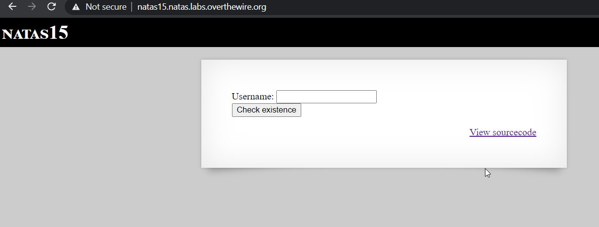

# Level 15
Pushing things further, here we do Blind SQL injection. Also, we'll make a python script to do the same.

##  Quest
We are presented with a simple page that checks if a user exists or not.


Backend code is similar to previous level with some important changes
```php
<?
/*
CREATE TABLE `users` (
  `username` varchar(64) DEFAULT NULL,
  `password` varchar(64) DEFAULT NULL
);
*/

if(array_key_exists("username", $_REQUEST)) {
    $link = mysql_connect('localhost', 'natas15', '<censored>');
    mysql_select_db('natas15', $link);
    
    $query = "SELECT * from users where username=\"".$_REQUEST["username"]."\"";
    if(array_key_exists("debug", $_GET)) {
        echo "Executing query: $query<br>";
    }

    $res = mysql_query($query, $link);
    if($res) {
    if(mysql_num_rows($res) > 0) {
        echo "This user exists.<br>";
    } else {
        echo "This user doesn't exist.<br>";
    }
    } else {
        echo "Error in query.<br>";
    }

    mysql_close($link);
} else {
?>
```
<br/><br/>
## Solution
From the source code, we can see that
  * Again unsanitized user input is inserted into query.
  * Although no output is displayed after query execution, we can make use of blind SQL injection.
  * When our query succeeds, we get user exists, and when it fails, we get user doesn't exist. we can leverage this functionality
  * Additionally we can see that there is a debug parameter, which displays query on screen.
  * Lastly, there is a users table with username and password column.
