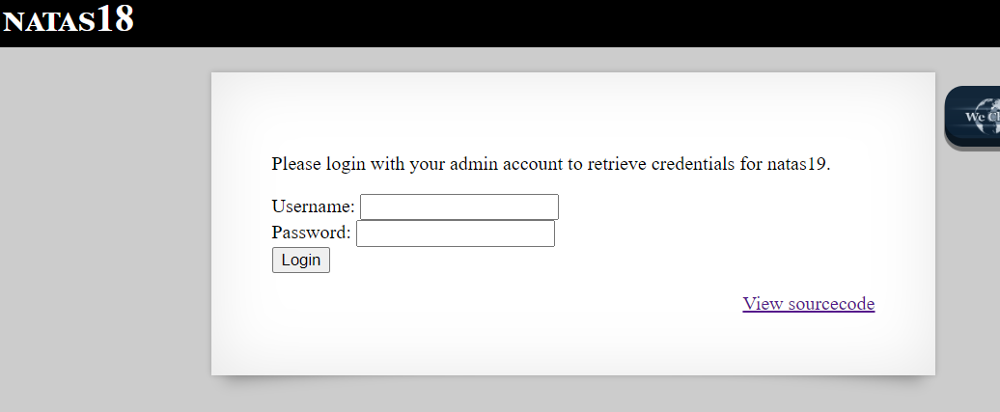
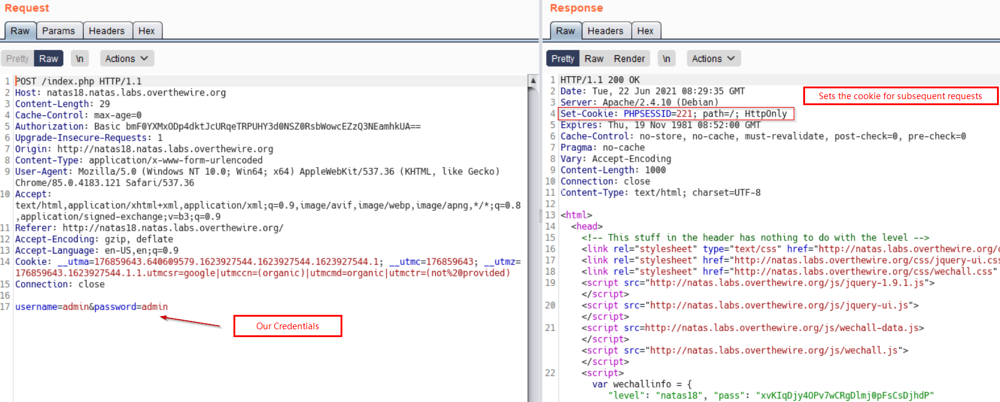
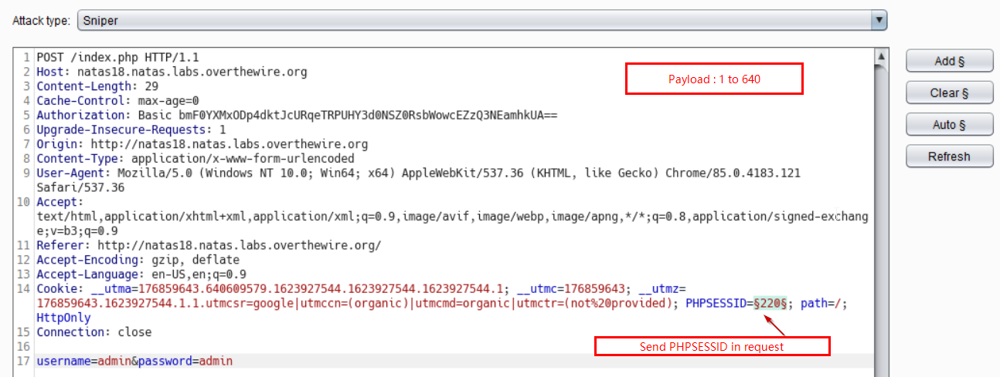
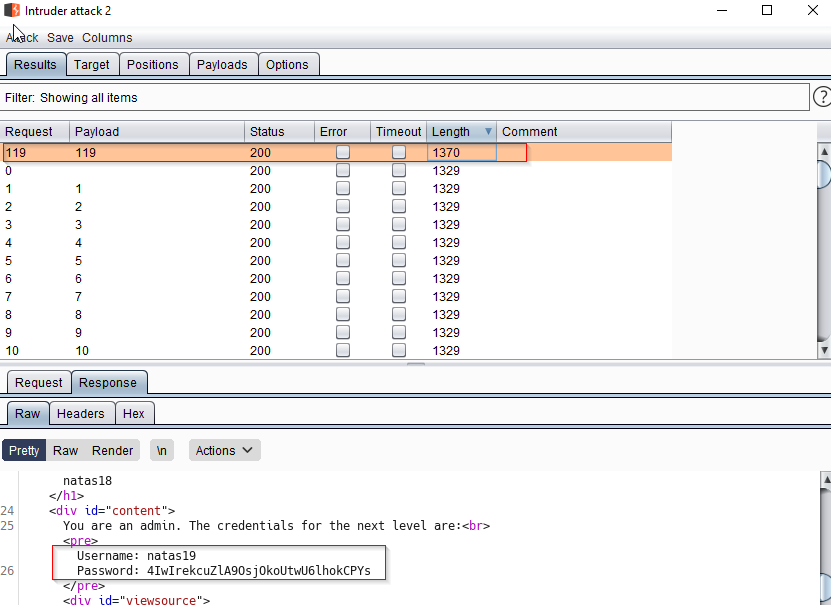

# Natas Level 18
This level deals with session management

# Quest
We are presented with below webpage


Backend code is below, lets comment it
```php
<?
$maxid = 640; // 640 should be enough for everyone

function isValidAdminLogin() {    // Always return 0
    if($_REQUEST["username"] == "admin") {
    /* This method of authentication appears to be unsafe and has been disabled for now. */
        //return 1;
    }

    return 0;
}

function isValidID($id) { /* {{{ */       // Checkis if parameter is numeric
    return is_numeric($id);
}
function createID($user) { /* {{{ */      // return a random number b/w 1 and 640
    global $maxid;
    return rand(1, $maxid);
}
function debug($msg) { /* {{{ */          // Display debug information
    if(array_key_exists("debug", $_GET)) {
        print "DEBUG: $msg<br>";
    }
}
function my_session_start() { /* {{{ */    
    if(array_key_exists("PHPSESSID", $_COOKIE) and isValidID($_COOKIE["PHPSESSID"])) {
    if(!session_start()) {
        debug("Session start failed");
        return false;
    } else {
        debug("Session start ok");
        if(!array_key_exists("admin", $_SESSION)) {
        debug("Session was old: admin flag set");
        $_SESSION["admin"] = 0; // backwards compatible, secure
        }
        return true;
    }
    }

    return false;
}
function print_credentials() { /* {{{ */
    if($_SESSION and array_key_exists("admin", $_SESSION) and $_SESSION["admin"] == 1) {
    print "You are an admin. The credentials for the next level are:<br>";
    print "<pre>Username: natas19\n";
    print "Password: <censored></pre>";
    } else {
    print "You are logged in as a regular user. Login as an admin to retrieve credentials for natas19.";
    }
}

$showform = true;
if(my_session_start()) {
    print_credentials();
    $showform = false;
} else {
    if(array_key_exists("username", $_REQUEST) && array_key_exists("password", $_REQUEST)) {
    session_id(createID($_REQUEST["username"]));
    session_start();
    $_SESSION["admin"] = isValidAdminLogin();
    debug("New session started");
    $showform = false;
    print_credentials();
    }
} 
```


## Solution
I am listing brief purpose of all functions mentioned above
`isValidAdminLogin()` : Return 0
`isValidID($id)` : Checks if provided id is numeric 
`createID()`     : Returns a random number b/w 1 and 640
`debug($msg)`    : Prints msg
`my_session_start()` : Checks if PHPSESSID exist and is vaild, if true, check if `admin` flag set in `$_SESSION`, if not set it to 0
`print_credentials()` : Checks if `admin` key exist and print password for next Level, if its 1.

Now, Lets focus on below segment of code:
```php
$showform = true;
if(my_session_start()) {
    print_credentials();
    $showform = false;
} else {
    if(array_key_exists("username", $_REQUEST) && array_key_exists("password", $_REQUEST)) {
    session_id(createID($_REQUEST["username"]));
    session_start();
    $_SESSION["admin"] = isValidAdminLogin();
    debug("New session started");
    $showform = false;
    print_credentials();
    }
} 
```
In the else part of above code, `admin` key is set to zero and `print_credentials` is called. So we want the condition in `if` statement to be true so that we don't go to the else block.
Simply, `my_session_start()` returns true if `PHPSESSID` is present.

Now throughout the code we donot set `$_SESSION['admin']` to 1, we set it to 0 various times. So, As to reveal the password for next level
it must be 1 and we can't set it, so i must already be admin.

To find that admin session, we bruteforce over all possible PHPSESSID, to find one that belongs to admin.

Below is a request (in Burp) sent, when we log in.


Above we can see, PHPSESSID is being set

We send this request to intruder, Set the PHPSESSID and start bruteforcing over all 640 values and we will login as admin in one of them as shown below


Below we see that we find a payload `109`, which reveals our password. This was session of admin.


<br/>

[<< Back](https://grey-fish.github.io/Natas/index.html)

