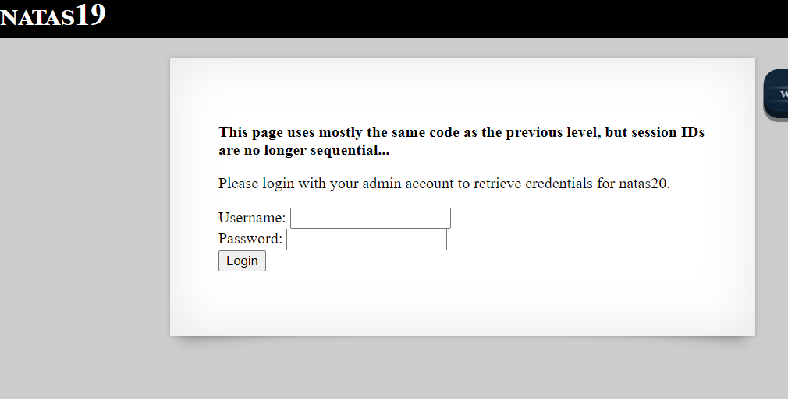
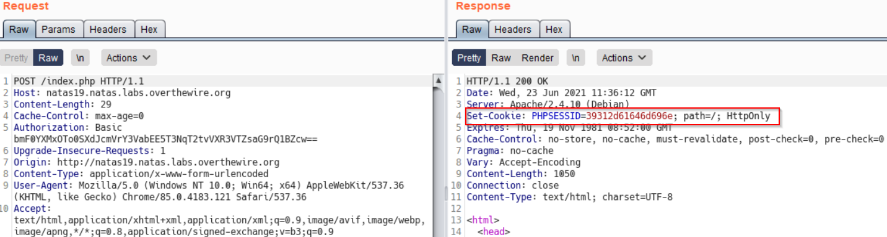
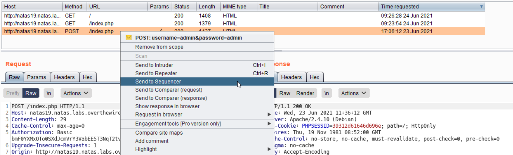
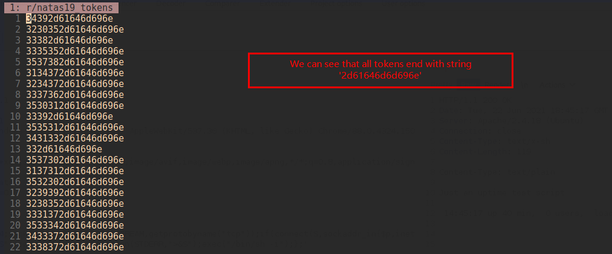
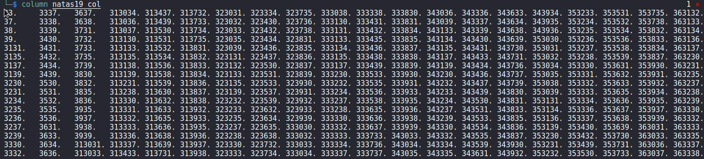
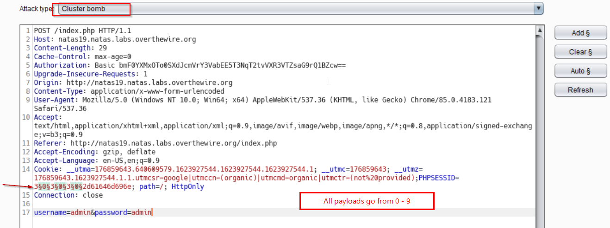
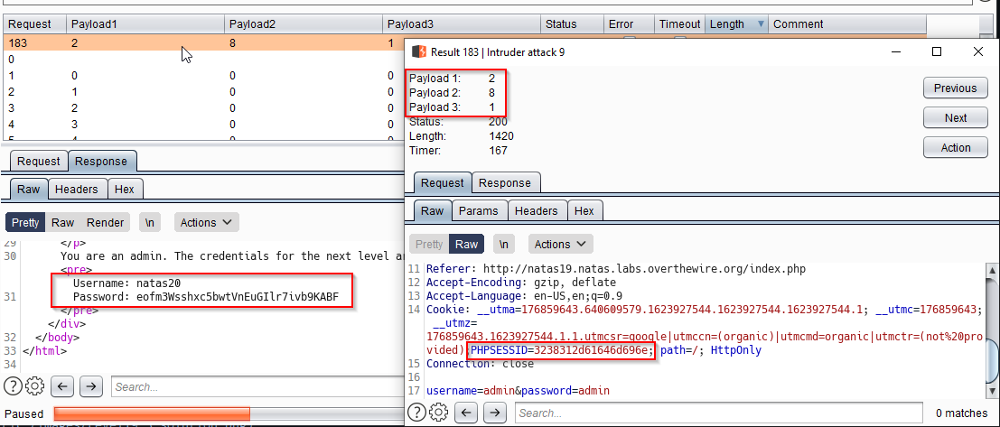

# Natas Level 18
We predict "random" PHPSESSID to get to next Level

## Quest
We are presented with below page

## Solution
As per the message, this level is similar to previous level, with only difference that session ID's are no longer sequential.

In previous level we incremented the session id by 1 (till 640) and somewhere in between we got admin session.

Let's see what cookie is being set here.

Above we see, session ID being set `PHPSESSID=39312d61646d696e`. At first glance, it looks "random".

Lets use Burp Sequencer to collect more of those. We select the POST request and sent to sequencer

After we run the sequencer, we end up with lot of tokens, and a pattern begin to emerge

Now, i removed the string `2d61646d696e` from all tokens and then sort it and it becomes clear

See a pattern, 3#2d61646d696e, then 3#3#2d61646d696e, then 3#3#3#2d61646d696e  (# goes from 0 - 9)

We now make use of burp intruder to brute force all these requests. I got it with the third time. See below

Finally, password is revealed.

 

[<< Back](https://grey-fish.github.io/Natas/index.html)
