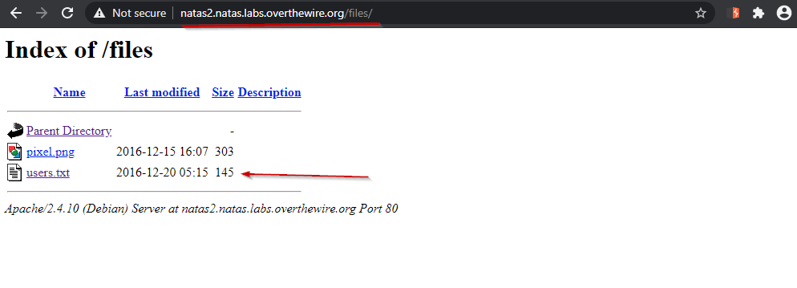

# Level 2

## Quest
We are greeted with a simple message "There is nothing on this page".

 

## Solution
Again we look at the source code and this time we find an image tag ``. 

 
 

Our image is located in `files` folder, so lets see what is in `files` folder.

 
 

Now we can see that in files folder there is another file named `users.txt` apart from our image file. When we open the `users.txt` file, password for next level is revealed.

 

[<< Back](https://grey-fish.github.io/Natas/index.html)
