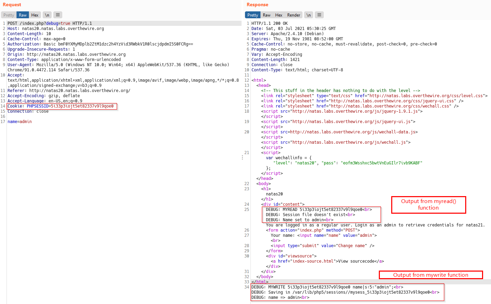
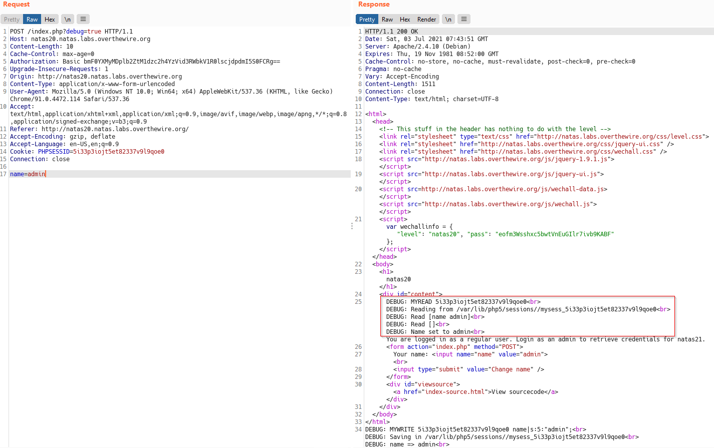
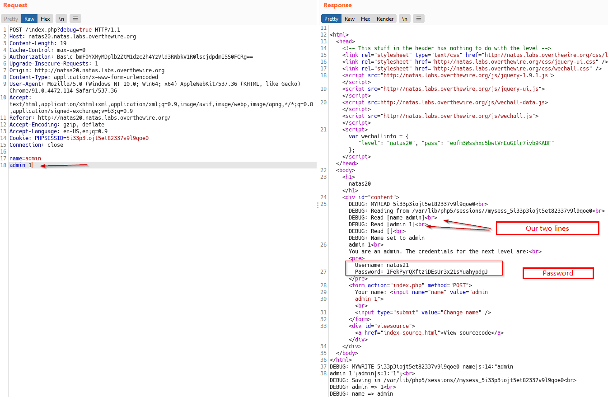

# Natas Level 20
> Level: Natas Level 20<br/>
> Solved: 30th June<br/>
> Remarks: Read PHP code and documentation<br/>
<br/>

## Quest
We are presented with following webpage


Here is the backend code
```php
<?
function debug($msg) { 
    if(array_key_exists("debug", $_GET)) {
        print "DEBUG: $msg<br>";
    }
function print_credentials() { 
    if($_SESSION and array_key_exists("admin", $_SESSION) and $_SESSION["admin"] == 1) {
    print "You are an admin. The credentials for the next level are:<br>";
    print "<pre>Username: natas21\n";
    print "Password: <censored></pre>";
    } else {
    print "You are logged in as a regular user. Login as an admin to retrieve credentials for natas21.";
    }
}
function myread($sid) { 
    debug("MYREAD $sid"); 
    if(strspn($sid, "1234567890qwertyuiopasdfghjklzxcvbnmQWERTYUIOPASDFGHJKLZXCVBNM-") != strlen($sid)) {
    debug("Invalid SID"); 
        return "";
    }
    $filename = session_save_path() . "/" . "mysess_" . $sid;
    if(!file_exists($filename)) {
        debug("Session file doesn't exist");
        return "";
    }
    debug("Reading from ". $filename);
    $data = file_get_contents($filename);
    $_SESSION = array();
    foreach(explode("\n", $data) as $line) {
        debug("Read [$line]");
    $parts = explode(" ", $line, 2);
    if($parts[0] != "") $_SESSION[$parts[0]] = $parts[1];
    }
    return session_encode();
}
function mywrite($sid, $data) { 
    // $data contains the serialized version of $_SESSION
    // but our encoding is better
    debug("MYWRITE $sid $data"); 
    // make sure the sid is alnum only!!
    if(strspn($sid, "1234567890qwertyuiopasdfghjklzxcvbnmQWERTYUIOPASDFGHJKLZXCVBNM-") != strlen($sid)) {
    debug("Invalid SID"); 
        return;
    }
    $filename = session_save_path() . "/" . "mysess_" . $sid;
    $data = "";
    debug("Saving in ". $filename);
    ksort($_SESSION);
    foreach($_SESSION as $key => $value) {
        debug("$key => $value");
        $data .= "$key $value\n";
    }
    file_put_contents($filename, $data);
    chmod($filename, 0600);
}
if(array_key_exists("name", $_REQUEST)) {
    $_SESSION["name"] = $_REQUEST["name"];
    debug("Name set to " . $_REQUEST["name"]);
}

print_credentials();

$name = "";
if(array_key_exists("name", $_SESSION)) {
    $name = $_SESSION["name"];
}
?>
```
<br/>

## Solution

Lets take breakdown the above code, we have following functions:

The `print_credentials()` function<br/>

  - This function will reveal the password for next level if `$_SESSION["admin"]` is equal to `1`.


The `mywrite()` function in two parts:

Part 1
```php
 debug("MYWRITE $sid $data"); 
 // make sure the sid is alnum only!!
 if(strspn($sid, "1234567890qwertyuiopasdfghjklzxcvbnmQWERTYUIOPASDFGHJKLZXCVBNM-") != strlen($sid)) {
 debug("Invalid SID"); 
    return;
 }
```
Above code checks if `$sid` is valid (_contains alphanumrics only_), `strspn` function [documentation](https://www.php.net/manual/en/function.strspn.php)

Part 2
```php
$filename = session_save_path() . "/" . "mysess_" . $sid;
$data = "";
debug("Saving in ". $filename);
ksort($_SESSION);
foreach($_SESSION as $key => $value) {
    debug("$key => $value");
    $data .= "$key $value\n";
}
file_put_contents($filename, $data);
chmod($filename, 0600);
```
Above `foreach` loop, loops over key value pairs of `$_SESSION` array and concatenates it as a string and store the whole string in `$data` variable, which is then stored in a file.<br/>

Note that each `$key - $value` pair is separated by `\n` (newline).

<span id=yellow>Summary:</span> `$_SESSION` variable is stored in a file, each key value pair is stored on a newline separated by a space.


Now, lets look at `myread()` function<br/>

Part 1
```php
debug("MYREAD $sid"); 
// Checks if sid is not alphanumeric
if(strspn($sid, "1234567890qwertyuiopasdfghjklzxcvbnmQWERTYUIOPASDFGHJKLZXCVBNM-") != strlen($sid)) {
  debug("Invalid SID"); 
  return "";
}
```
Again, this code checks if `$sid` is valid (_contains alphanumrics only_)

Part 2
```php
// Create a filename with full path  | session_save_path() gives dir name, rest things are concatenated
$filename = session_save_path() . "/" . "mysess_" . $sid; // Ex: /var/lib/php5/sessions//mysess_5i33p3iojt5et82337v9l9qoe0
if(!file_exists($filename)) {  // exit if file doesn't exist
    debug("Session file doesn't exist");
    return "";
}
debug("Reading from ". $filename);
$data = file_get_contents($filename);  // If it does  exist, read it into $data var
$_SESSION = array();
foreach(explode("\n", $data) as $line) { read each line of file
    debug("Read [$line]");
$parts = explode(" ", $line, 2);
if($parts[0] != "") $_SESSION[$parts[0]] = $parts[1];
}
return session_encode();
}
```

Above we read the contents of the file line by line, which we stored previously using `mywrite` function.<br/> The code reads a line and then checks if it contains a key and a value separated by space, if it does, then put that in `$_SESSION` variable as a key value pair.

Suppose file contains:
```
name john
hair blue
```
then `$_SESSION` variable will contain key value pair like `$_SESSION['name'] = 'john'` and `$_SESSION['hair'] = 'blue'`
<br/><br/>

Alright, now lets fire up Burp, and send some requests.<br/>

Below is a screenshot of the first request sent with `debug` parameter set.



Observations from above request

  - It's a POST request, sent when we entered name `admin` and press enter<br/>
  - The `PHPSESSID` is set as `$sid` in the code. (evident from `DEBUG` output)<br/>
  - `$_SESSION["name"]` is set to `"admin"`  (This is important)<br/>
  - Being the first request, `$_SESSION` variable is not stored in a file yet<br/>


Now send this request to Burp repeater and send the same request again, we get this result.



Above we can see $_SESSION stored and read from `/var/lib/php5/sessions//mysess_5i33p3iojt5et82337v9l9qoe0` file.
  - `DEBUG: Read [name admin]`  implies `$_SESSION['name'] = 'admin'`

Now, we know that in order to reveal the password we need `$_SESSION['admin'] = 1`, and to do that we append the following line in our POST Body
`admin `


Above payload sets `$_SESSION[admin]` to `1` and reveals the password for next level.




<span id=green>**Lessons learned**</span><br/>
  - Before starting the challenge, i had no knowledge about the function used in Backend code.
  - So Always read documentation of functions. I read docs for [explode](https://www.php.net/manual/en/function.explode.php), [strspn](https://www.php.net/manual/en/function.strspn.php), [session_save_path](https://www.php.net/manual/en/function.session-save-path.php) <br/>
  - RTFM<br/>
  - When faced with large code, break it down to chunks to understand the big picture.

This was Level 20. 

<br/>

[<< Back](https://grey-fish.github.io/Natas/index.html)
