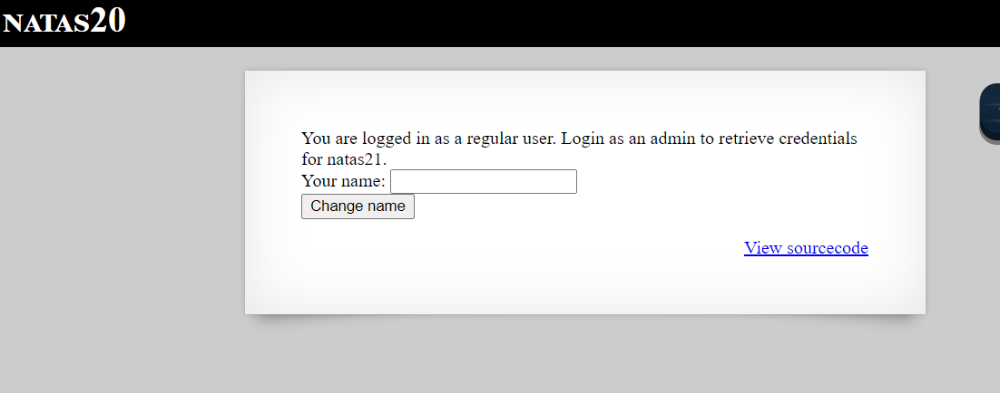

# Natas Level 20
> Level: Natas Level 20<br/>
> Solved: 30th June<br/>
> Remarks: Read PHP code and documentation<br/>
<br/>

## Quest
We are presented with this webpage


Here is the backend code
```php
<?
function debug($msg) { 
    if(array_key_exists("debug", $_GET)) {
        print "DEBUG: $msg<br>";
    }
function print_credentials() { 
    if($_SESSION and array_key_exists("admin", $_SESSION) and $_SESSION["admin"] == 1) {
    print "You are an admin. The credentials for the next level are:<br>";
    print "<pre>Username: natas21\n";
    print "Password: <censored></pre>";
    } else {
    print "You are logged in as a regular user. Login as an admin to retrieve credentials for natas21.";
    }
}
function myread($sid) { 
    debug("MYREAD $sid"); 
    if(strspn($sid, "1234567890qwertyuiopasdfghjklzxcvbnmQWERTYUIOPASDFGHJKLZXCVBNM-") != strlen($sid)) {
    debug("Invalid SID"); 
        return "";
    }
    $filename = session_save_path() . "/" . "mysess_" . $sid;
    if(!file_exists($filename)) {
        debug("Session file doesn't exist");
        return "";
    }
    debug("Reading from ". $filename);
    $data = file_get_contents($filename);
    $_SESSION = array();
    foreach(explode("\n", $data) as $line) {
        debug("Read [$line]");
    $parts = explode(" ", $line, 2);
    if($parts[0] != "") $_SESSION[$parts[0]] = $parts[1];
    }
    return session_encode();
}
function mywrite($sid, $data) { 
    // $data contains the serialized version of $_SESSION
    // but our encoding is better
    debug("MYWRITE $sid $data"); 
    // make sure the sid is alnum only!!
    if(strspn($sid, "1234567890qwertyuiopasdfghjklzxcvbnmQWERTYUIOPASDFGHJKLZXCVBNM-") != strlen($sid)) {
    debug("Invalid SID"); 
        return;
    }
    $filename = session_save_path() . "/" . "mysess_" . $sid;
    $data = "";
    debug("Saving in ". $filename);
    ksort($_SESSION);
    foreach($_SESSION as $key => $value) {
        debug("$key => $value");
        $data .= "$key $value\n";
    }
    file_put_contents($filename, $data);
    chmod($filename, 0600);
}
if(array_key_exists("name", $_REQUEST)) {
    $_SESSION["name"] = $_REQUEST["name"];
    debug("Name set to " . $_REQUEST["name"]);
}

print_credentials();

$name = "";
if(array_key_exists("name", $_SESSION)) {
    $name = $_SESSION["name"];
}
?>
```
<br/>

## Solution

Lets take breakdown the above code:

1. The `print_credentials()` function 
    - As in previous levels, this function will reveal the password for next level if `$_SESSION["admin"]` is equal to `1`.

2. The `mywrite()` function
Part 1
```php
 debug("MYWRITE $sid $data"); 
    // make sure the sid is alnum only!!
    if(strspn($sid, "1234567890qwertyuiopasdfghjklzxcvbnmQWERTYUIOPASDFGHJKLZXCVBNM-") != strlen($sid)) {
    debug("Invalid SID"); 
        return;
    }
```

This function checks if `$sid` is valid (contains alphanumrics only), read about `strspn` function here

Part 2
```php
$filename = session_save_path() . "/" . "mysess_" . $sid;
$data = "";
debug("Saving in ". $filename);
ksort($_SESSION);
foreach($_SESSION as $key => $value) {
    debug("$key => $value");
    $data .= "$key $value\n";
}
file_put_contents($filename, $data);
chmod($filename, 0600);
```
From above code we an see that the foreach loop loops over key value pair of `$_SESSION` array and concatenates it as a string and store the whole string in `$data` variable.
Note that each $key $value pair is separated by "\n" (newline).

To summarize, `$_SESSION` variable is stored in a file, each key value pair is stored on a newline separated by a space.

3. Now, let see the myread() function
Part 1
```php
function myread($sid) { 
    debug("MYREAD $sid"); 
    // Checks if sid is not alphanumeric
    if(strspn($sid, "1234567890qwertyuiopasdfghjklzxcvbnmQWERTYUIOPASDFGHJKLZXCVBNM-") != strlen($sid)) {
    debug("Invalid SID"); 
        return "";
    }
```

As we saw previously, this function checks if `$sid` is valid (contains alphanumrics only), read about `strspn` function here

Part 2
```php
// Create a filename with full path  | session_save_path() gives dir name, rest things are concatenated
$filename = session_save_path() . "/" . "mysess_" . $sid;       // An ex: /var/lib/php5/sessions//mysess_5i33p3iojt5et82337v9l9qoe0
if(!file_exists($filename)) {  // exit if file doesn't exist
    debug("Session file doesn't exist");
    return "";
}
debug("Reading from ". $filename);
$data = file_get_contents($filename);  // If it does  exist, read it into $data var
$_SESSION = array();
foreach(explode("\n", $data) as $line) { read each line of file
    debug("Read [$line]");
$parts = explode(" ", $line, 2);
if($parts[0] != "") $_SESSION[$parts[0]] = $parts[1];
}
return session_encode();
}
```

Here we read the contents of the file line by line, which we stored previously using mywrite function. The code reads a line and then checks if if contains a key and a value separated by space, if it is , then put that is`$_SESSION` variable as key value pair.

Suppose file contains:
```
name john
hair blue
```
then `$_SESSION` variable will contain key value pair like `$_SESSION['name'] = 'john'` and `$_SESSION['hair'] = 'blue'`;

Alright, now lets fire up Burp, and send some requests.
Below is a screenshot of the first request sent with `debug` parameter set.


Note something from above request

- It's a POST request, i entered name `admin` and press enter
- The `PHPSESSID` is set as $sid in the code. (evident from DEBUG output)
- `$_SESSION["name"]` set to `"admin"`  (This is important)
- Being the first request, $_SESSION variable is not stored in a file

Now send this request to Burp repeater and send the same request few times, we get this result.


Above we can see $_SESSION stored and read from `/var/lib/php5/sessions//mysess_5i33p3iojt5et82337v9l9qoe0` file.
- `DEBUG: Read [name admin]`  implies $_SESSION['name'] = 'admin'

Now, we know that in order to reveal the password we need $_SESSION['admin'] = 1, so we add the following line in our POST Body

Payload
`name=admin
admin 1`

Above payload set $_SESSION[admin] to 1 and reveals the password.


<br/>

[<< Back](https://grey-fish.github.io/Natas/index.html)
