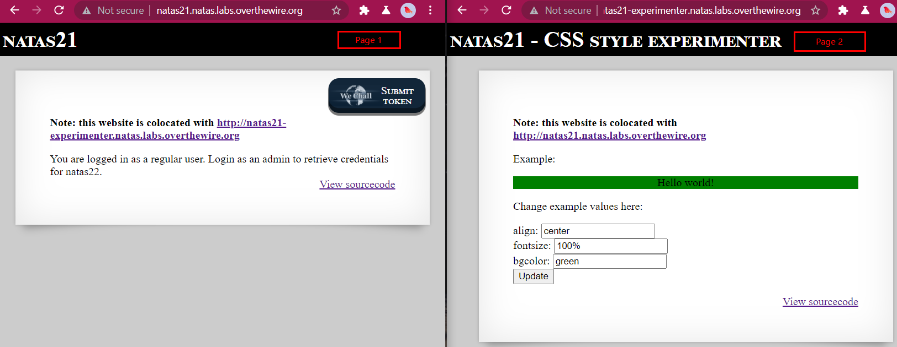
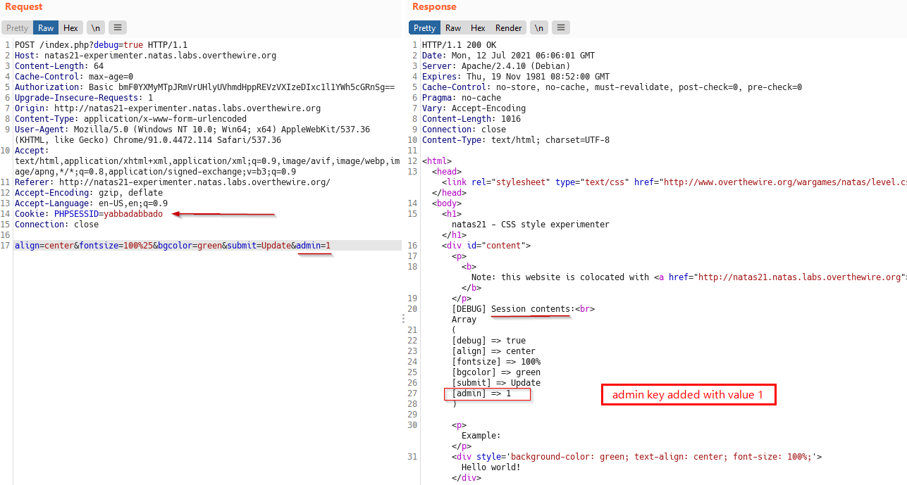
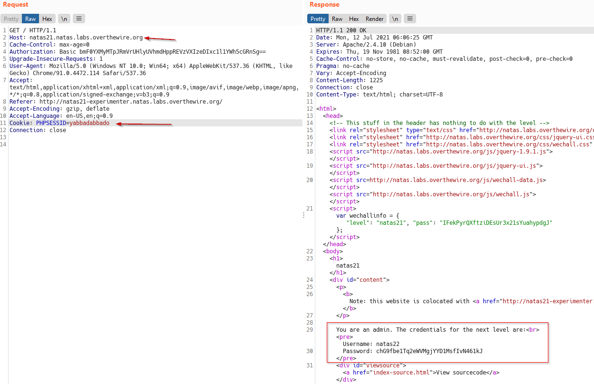

# Natas
> Level : Natas Level 21<br/>
> Solved : 12th July 2021<br/>
> Remarks : Dealing in Cookies<br/>
<br/>

## Quest
We are presented with below webpages



<br/>

The Backend code on First page is similar to previous level, it consists of `print_ceredentials` function, which reveals the password if `$_SESSION[admin] == 1`.<br/>

Below is code for Second Page. Lets comment it
```php
<?  
session_start();

// if update was submitted, store it        // BAD Practise
if(array_key_exists("submit", $_REQUEST)) { // Take values from POST request
    foreach($_REQUEST as $key => $val) {    // +and append to $_SESSION array
    $_SESSION[$key] = $val;
    }
}

if(array_key_exists("debug", $_GET)) {    // Print DEBUG Information
    print "[DEBUG] Session contents:<br>";
    print_r($_SESSION);
}

// only allow these keys
$validkeys = array("align" => "center", "fontsize" => "100%", "bgcolor" => "yellow");
$form = "";

$form .= '<form action="index.php" method="POST">'; 
foreach($validkeys as $key => $defval) {
    $val = $defval;
    if(array_key_exists($key, $_SESSION)) {
    $val = $_SESSION[$key];
    } else {
    $_SESSION[$key] = $val;
    }
    $form .= "$key: <input name='$key' value='$val' /><br>";
}
$form .= '<input type="submit" name="submit" value="Update" />';
$form .= '</form>';

$style = "background-color: ".$_SESSION["bgcolor"]."; text-align: ".$_SESSION["align"]."; font-size: ".$_SESSION["fontsize"].";";
$example = "<div style='$style'>Hello world!</div>";

?>

<p>Example:</p>
<?=$example?>
```

<br/>
<br/>

## Solution

Reading the code for Second page gives us our first hint. Below is the Bad Code. It appends whatever is in the POST Body to `$_SESSION` array. BAD Practise !

```php
if(array_key_exists("submit", $_REQUEST)) { // Take values from POST request
    foreach($_REQUEST as $key => $val) {    // +and append to $_SESSION array
    $_SESSION[$key] = $val;
    }
}
```
<br/>
<span id=green>Lets exploit this. we know to solve the level, we need to add key `admin` with value `1` to `$_SESSION` array.</span>

<br/>
Below is a POST request with `admin=1` added to body. Optionally `PHPSESSID` has also been changed to identify the session.
We can see in the output that our payload has been added to `$_SESSION` array.



<br/>

Now, our session, identified by `PHPSESSID=yabbadabbado` has `$_SESSION[admin]` set to `1`.

So simply send a request to first webpage with same Cookie, and it reveals the password for next Level.



<br/>
<span id=green>**Takeaway**</span><br/>

  - Read the documentation for [session_start()](https://www.php.net/manual/en/function.session-start.php) function
  - A User session is identified with its Cookie

<br/>
This was relatively easy one.


<br/>

[<< Back](https://grey-fish.github.io/Natas/index.html)
