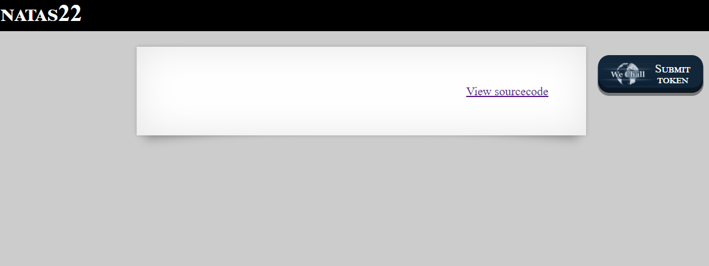
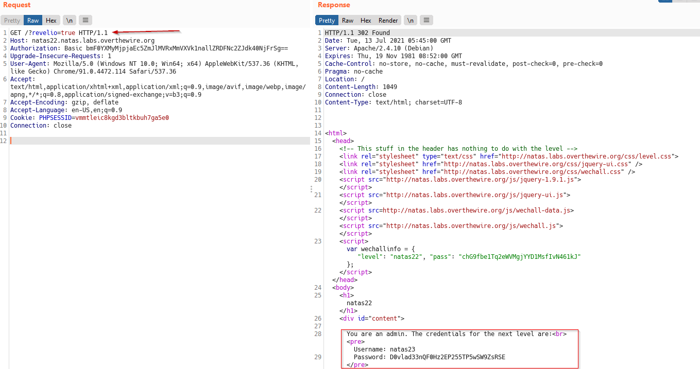

# Natas
> Level : Natas Level 22<br/>
> Solved : 13th July 2021<br/>
> Remarks : This was Easy Peasy<br/>
<br/>

## Quest
We are presented with below webpages


<br/>

Relevant Backend code
```php
<?
session_start();

if(array_key_exists("revelio", $_GET)) {
    // only admins can reveal the password
    if(!($_SESSION and array_key_exists("admin", $_SESSION) and $_SESSION["admin"] == 1)) {
    header("Location: /");
    }
}
?>
<html>
<head>
<!-- This stuff in the header has nothing to do with the level -->
<link rel="stylesheet" type="text/css" href="http://natas.labs.overthewire.org/css/level.css">
<link rel="stylesheet" href="http://natas.labs.overthewire.org/css/jquery-ui.css" />
<link rel="stylesheet" href="http://natas.labs.overthewire.org/css/wechall.css" />
<script src="http://natas.labs.overthewire.org/js/jquery-1.9.1.js"></script>
<script src="http://natas.labs.overthewire.org/js/jquery-ui.js"></script>
<script>var wechallinfo = { "level": "natas22", "pass": "<censored>" };</script></head>
<body>
<h1>natas22</h1>
<div id="content">

<?
    if(array_key_exists("revelio", $_GET)) {
    print "You are an admin. The credentials for the next level are:<br>";
    print "<pre>Username: natas23\n";
    print "Password: <censored></pre>";
    }
?>
```

<br/>

## Solution

This one was surprisingly easy. From the above code we can deduce the following<br/>
  - If `revelio` URL parameter exists, we'll be redirected to `/` <br/>
  - Password will be revealed if we send a parameter `revelio` in the GET request<br/>

<br/>
Below we do that by adding `?revelio=true`, we recieve a 302 redirect and password for next Level is revealed.




This was a quick one !

<br/>

[<< Back](https://grey-fish.github.io/Natas/index.html)
