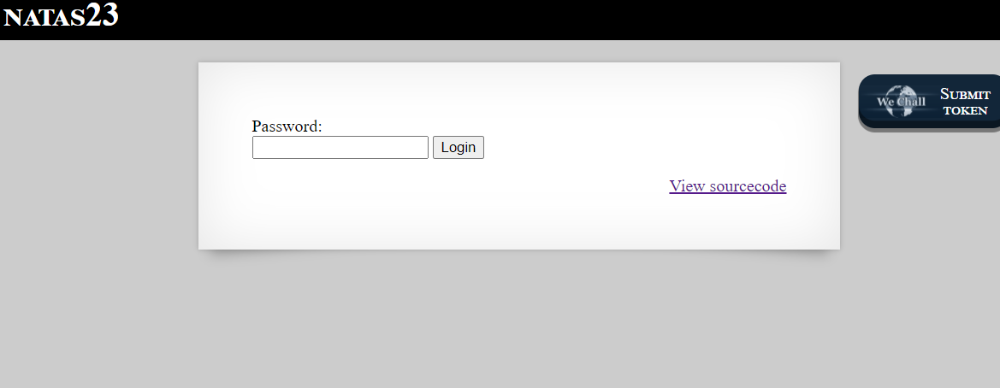
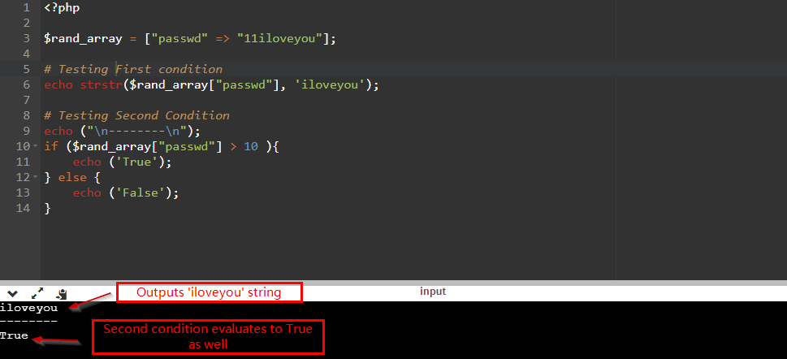
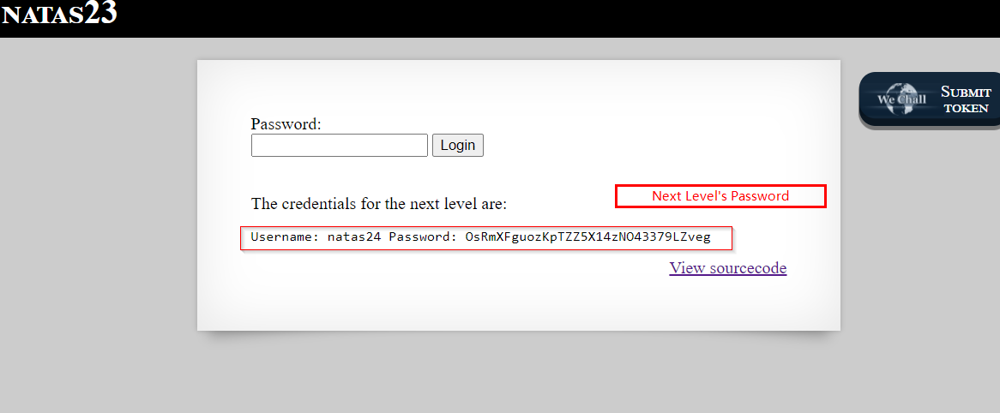

# Natas
> Level : Natas Level 22<br/>
> Solved : 13th July 2021<br/>
> Remarks : This was Easy Peasy<br/>
<br/>

## Quest
We are presented with below webpages


<br/>

Relevant Backend code

```php
Password:
<form name="input" method="get">
    <input type="text" name="passwd" size=20>
    <input type="submit" value="Login">
</form>

<?php
    if(array_key_exists("passwd",$_REQUEST)){
        if(strstr($_REQUEST["passwd"],"iloveyou") && ($_REQUEST["passwd"] > 10 )){
            echo "<br>The credentials for the next level are:<br>";
            echo "<pre>Username: natas24 Password: <censored></pre>";
        }
        else{
            echo "<br>Wrong!<br>";
        }
    }
    // morla / 10111
?>  
```

<br/>

## Solution

Lets breakdown the above code. Read about `strstr` function [here.](https://www.php.net/manual/en/function.strstr.php)

we need below 2 condition to be true in order to reveal password for next Level<br/>

  - `strstr($_REQUEST["passwd"], "iloveyou)`<br/>
  - `$_REQUEST["passwd"] > 10`<br/>

See below test sessions 
```php
# Lets suppose passwd is 'iloveyou'
$rand_array = [ "passwd" => "iloveyou" ];
echo strstr($rand_array["passwd"], 'iloveyou');    // Output: iloveyou

# Above returns a non-empty string, so first condition is true

# Lets go for second condition
if ($rand_array["passwd"] > 10 ){
    echo ('True');
} else {
    echo ('False');
}
# Above code Prints False 

# Note here we are comparing a string type with Number 
```

In Above code session, we showed that 1st condition can be made true. Now we look at second condition.

The Second condition produces `False` because we are comparing numbers and strings.

By Using the Powers of Internet and Reading the PHP documentation, i came to know about <span id=green>Numeric Strings.</span> <br/>Here are the official [docs](https://www.php.net/manual/en/language.types.numeric-strings.php)<br/>
In Simple words, it states:
> A PHP string is considered numeric if it can be interpreted as an int or a float<br/>
> This happens when string is numeric like "1" or "1.0" etc or leading Numeric like "11hello".<br/>
> So, '11hello' would be treated as number 11 in arthmetic operations

So to get a number > `10`, i choose `11iloveyou` password. It satisfies both conditions. Lets test again



<br/>

Below we see password of next level is revealed. 




