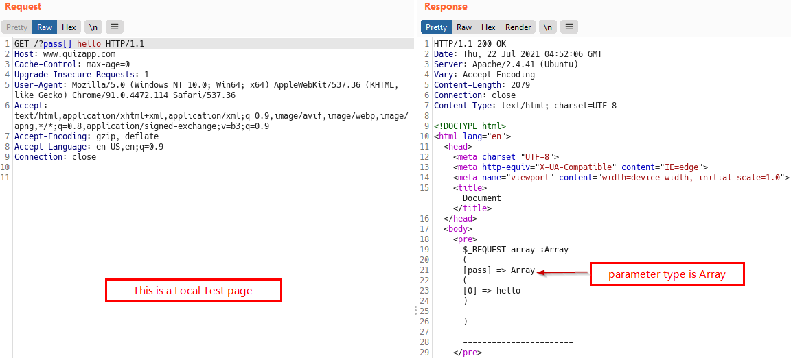

# Natas
> Level : Natas Level 24<br/>
> Solved : 22nd July 2021<br/>
> Remarks : Errors are good<br/>
<br/>

# Quest
We are presented with below webpage


Relevant Backend Code

```php
<?php
    if(array_key_exists("passwd",$_REQUEST)){
        if(!strcmp($_REQUEST["passwd"],"<censored>")){
            echo "<br>The credentials for the next level are:<br>";
            echo "<pre>Username: natas25 Password: <censored></pre>";
        }
        else{
            echo "<br>Wrong!<br>";
        }
    }
    // morla / 10111
?> 
```

<br/>

## Solution
Above code use [strcmp](https://www.php.net/manual/en/function.strcmp.php) function. Which returns `0` when provided two identical strings, `!0` is `1` , which is `True`, then password for next Level is revealed.

So initially it seems, we need to know the `<censored>` password, to crack this. (which can be anything!)

While reading the documentation, in *user contributed notes*, i stumbled upon this:
> Since it may not be obvious to some people, there is another possible return value for this function.<br/>
> strcmp() will return NULL on failure.


Above information is useful due to following behaviour of `NULL` in PHP :

```php
echo (!NULL);     // Outputs 1

# Which is True
```

So our task is to cause an error when  `if(!strcmp($_REQUEST["passwd"],"<censored>")){` executes and we'll be golden.

I tried many things, but in the end what succedded was `passwd[]=hello` payload revealed the password.


<br/>
Out of curiosity, i wanted to see the contents of `$_REQUEST` superglobal after our payload. <br/>
So i made a simple PHP page for that, below is the output if someone wants to know how payload works.



<span id=green>**Takeaway**</span><br/>

  - This is repetitive, but RTFM, in this case, user notes helped me a lot<br/>
  - To cause error in `strcmp`, we changed one argument type to array<br/>

<br/>
This was level 24. 🎊
<br/>

[<< Back](https://grey-fish.github.io/Natas/index.html)
